# Environment, Shell, Script and PATH lab

## Goal

## LAB Environment 

This lab will focus on the shell environment I created a directory with subfolders and files, the structure and contents can be found [here](./fixtures/environment-shell-path-lab/)

## Lab 0: Shell and environment baseline

I used `mkdir -p ~/environment-shell-path-lab/{bin,logs,tmp,baseline}` to create the skeleton of the directory

`mkdir` creates directories
`-p` does not report an error when a directory already exists and creates missing parent directories as needed.

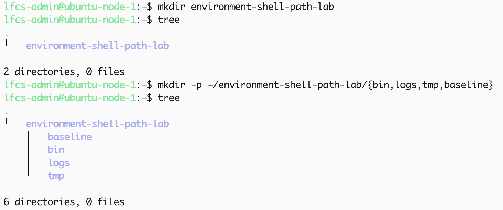

The `{}` is the shell's brace expansion which allows creation of subfolders.

`$` allows expansion for special parameters

`$SHELL` describes the current shell program being used

`$0` tells me the shell being used by the current session

`$$` represents the child's PID of the current shell

in the `ps` output the PID represents the sub/child shell whereas PPID is the parent shell

`$SHELL`, `$0`, `/proc/$$/shell`, they could still describe the shell being used in this case `bash`, however they could be referring to the parent shell or a child shell started by the parent shell

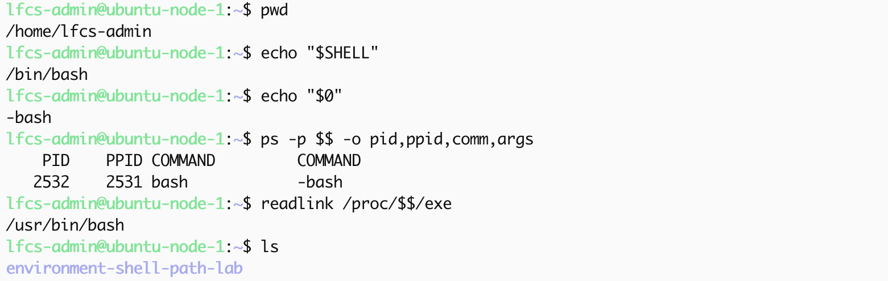

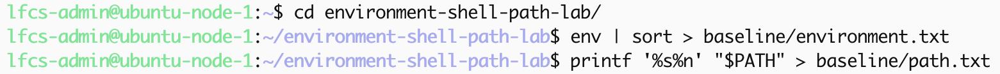

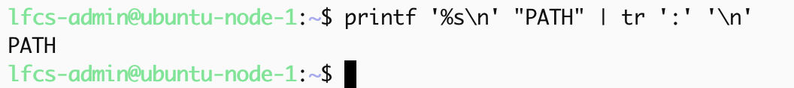

## Lab 1 Shell variables & child-process inheritance

`LAB_MODE=practice` saves the variable in current shells's own variable state. the next shell session login, this variable will disappear from the shell variables, the 1st child shell could not see it because the variable had not been exported into the environment inherited by the childe process.

`export` causes the shell variables to be marked for inclusion in the environment passed to subsequently created child processes. A child process inherits the parent's shell environment, however it cannot modify it.

`unset LAB MODE` removes the variables from the current shell wether exported or not. Once it is removed from the parent, future child process cannot inherit it.

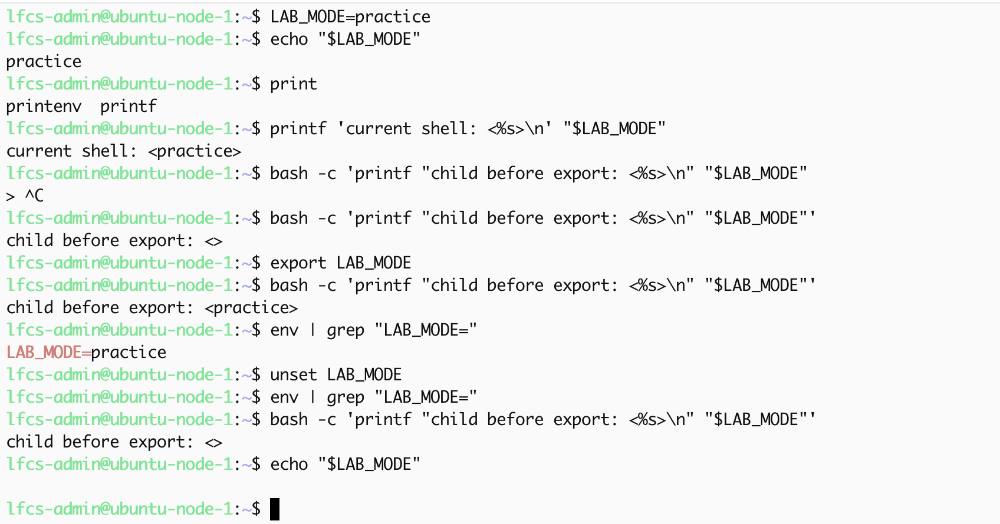

### Mental model

Before `export` the variable is saved in the current's shell variable state. After `export` the shell variables are marked for inclusion in the environment passed to child processes. Using `unset` removes the variables from the current shell wether exported or not, once removed from the parent, future chill process cannot inherit it.

## Lab. 2 quoting and shell expansion

For this lab, I use `LAB_NAME=`linux administration lab`
[lab_name](./lab_images/quoting-expansions/S1.png)

`unquoted` expansion, word splitting and pathname expansion can occur

`'single'` quotes contents are treated literally.

Within `"double quotes"` some shell functionalities will still work, these include:

`$variable`
`$(command)`
`command`

word splitting and pathname expansion are suppressed.

### Unquoted expansion

`printf '<%s>\n' $LAB_NAME` produced multiple arguements because the expansion was unquoted, word splitting occurred creating multiple arguements.

[$LAB_NAME](./lab_images/quoting-expansions/S2.png)

### Double quotes

`printf '<%s>\n' "$LAB_NAME"`

Parameter expansion occurs but preserves the results as one argument.

["$LAB_NAME"](./lab_images/quoting-expansions/S3.png)

### Single quotes

`printf '<%s>\n' '$LAB_NAME'` printed out the literal contents because the shell prevent shell expansion from within single quotes

['$LAB_NAME'](./lab_images/quoting-expansions/S4.png)

### Globbing

[lab_environment](./lab_images/quoting-expansions/S5.png)
 
when running the command `printf '<%s>\n' tmp/*.conf`, the shell expands `tmp/*.conf`,  glob expansion occurs print all files ending with `conf`

[tmp/*.conf](./lab_images/quoting-expansions/S6.png)

Both `printf '<%s>\n' "tmp/*.conf"` and `printf '<%s>\n' 'tmp/*.conf'` both prevented pathname expansion, so `printf` receives the literal arguments: `tmp/*.conf`

["tmp/*.conf" 'tmp/*.conf'](./lab_images/quoting-expansions/S7.png)

### Command substitution

`printf 'working directory: %s\n' "$(pwd)"`, the shell 1st performs `"$(pwd)"`, its stdout is captured and substituted into the command, finally the outer command executes. 

["tmp/*.conf" 'tmp/*.conf'](./lab_images/quoting-expansions/S8.png)

["tmp/*.conf" 'tmp/*.conf'](./lab_images/quoting-expansions/S9.png)

## Lab 3: Script identity and execution

### Script requirements

The script must print:
script pathname
real user
current shell process PID
parent PID
current working directory
HOME
PATH
LAB_MODE, or UNSET when missing

Requirements:
Use a Bash shebang
Use printf
Do not hard-code the output values
Do not use sudo
Do not copy the expected output into the script

### Relative and absolute execution

[scriptv1](./lab_images/script-identity-and-execution/s1.png)

The initial script I wrote had a bug due to hardcoding the incorrect name of the script, this resulted in:

- the script outputted the incorrect name of the script in the pathname even when changing directory, this proved that `realpath` resolved the hard-coded filename relative to the current working directory.

[bugs_scriptv1](./lab_images/script-identity-and-execution/s2.png)

`$PWD` changed each time I switched the directory: `lab root`, `bin` and `tmp` while `$HOME` remained the same.

I improved the script by:
- adding double quotes and the correct variable that would dynamically print the script's name/path used to invoke the current script.
- using the correct variable for HOME
- added the LAB_MODE variable which defaults to UNSET if it's missing

[fixed_ scriptv2](./lab_images/script-identity-and-execution/s3.png)

PID/PPID observation:

The script's `$$` is the child's PID, while `$PPID` is the parent shell PID.

The script currently prints:

`echo "$PPID"` which is `909171`
`echo "$$"` which changes each time the script runs

Which represents something like this:

interactive Bash PID 909171
        |
        |-- show-context.sh PID 913777
        |-- show-context.sh PID 913814
        |-- show-context.sh PID 913855
        |-- show-context.sh PID 913904

### Controlled failure: execute permission

The execute permission bit was removed from script for the owner.

when attempting to run the script the following was outputted: `-bash: ./show-context.sh: Permission denied`

[`chmod -x_permission`](./lab_images/script-identity-and-execution/s4.png)

The file is owned by lfcs-admin, so the owner permission bits apply, the owner's permissions are rw-, which does not include the execute permission. 

I restored the execute bit for the owner permission class, this was the smallest repair as it allowed the owner to execute the file. `chmod 777` would have granted rwx permissions to all permission classes increasing the blast radius, that is a security risk, this could allow unauthorized users to read, modify and execute the script.

[`chmod u+x_permission`](./lab_images/script-identity-and-execution/s5.png)

In the above image I mistakenly added the execute permission for others, i rectified this by removing the execute permission for others and adding it for the owner of the file.

### Controlled failure: command lookup

I moved to the lab root and ran `show-context.sh` the terminal's output `show-context.sh: command not found`

Hypothesis:
The script exits and is executable but Bash treats it as a command name and searches the directories in $PATH. The lab’s bin directory is not currently in `$PATH`, so Bash cannot locate it by name. Using `./bin/show-context.sh`, `./show-context.sh` or the absolute pathname works because those forms explicitly identify the file.

`command -v show-context.sh` returns nothing, the lab's bin directory is not present in PATH.  `./bin/show-context.sh` works because the pathname is explicit, so Bash does not need to perform PATH lookup. Whereas `show-context.sh` does not because Bash treats it as a command name and searches the directories in $PATH

[u+x_permission](./lab_images/script-identity-and-execution/s6.png)

## Lab 4: Command lookup and temporary PATH changes

###  Goal

How bash runs commands

To understand:
- the difference between shell builtins, aliases, functions, hashed commands, and executable files
- How bash decides to run commands

### Builtins vs executable commands

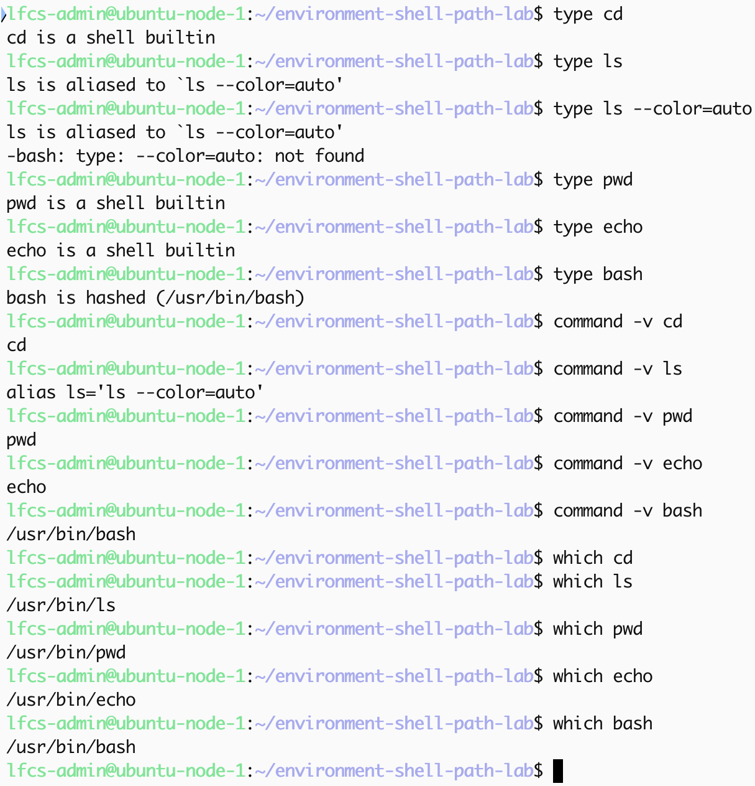

I used `type`, `command -v` and `which` to determine the difference between shell builtins and command executables

bash can resolve to the shell builtin while external executables exist on the disk

The shell can resolve `pwd` and `echo` to the built in version; External executable versions also exist on the disk. Both can be true.

For `ls`, the shell resolves to the alias first, consequently the alias summons the external `ls` executable.

For `bash`, the shell resolves to the hash table, where the command is cached

### type vs command -v vs which

`which` locates the executable path
`command -v` shows what Bash would resolve the command to
`type`  Classifies and explains how Bash interprets a command name

`which` shows an executable path is present, but Bash will not always execute it. 

### Script not found through PATH

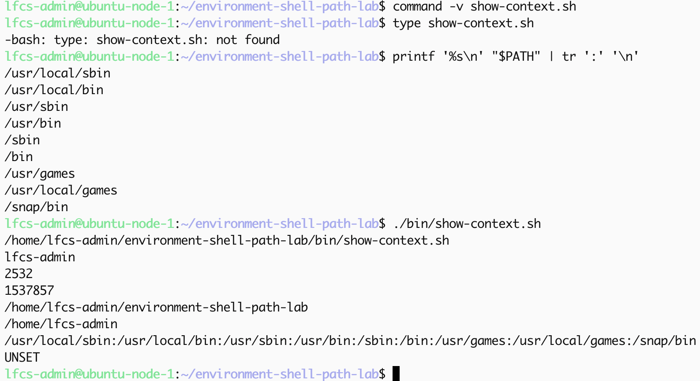

I confirmed that the `show-context.sh` script was not in the shell PATH.

`type show-context.sh` outputted `-bash: type: show-context.sh: not found`

`command -v`'s output was blank

This happened because there was no explicit pathname to the file so bash attempted to a PATH-based command lookup. 

when a `/` is present, Bash does not perform a command lookup, instead it is treated as a pathname because it explicitly points directly to the executable.

without a `/`, Bash resolves it as a command name.

### Temporary PATH modification

I backed up the current PATH to a file, so tha i can restore it later on
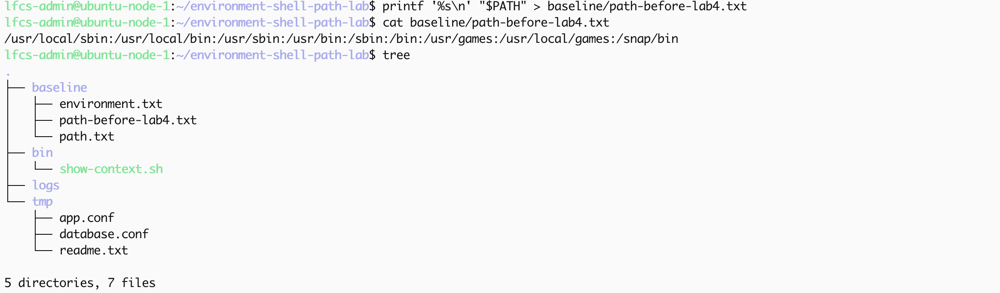

I proceeded to prepend the lab `bin` directory to PATH `PATH="/home/lfcs-admin/environment-shell-path-lab/bin:$PATH"`
confirmed the state of PATH with: `printf '%s\n' "$PATH" | tr ':' '\n'`

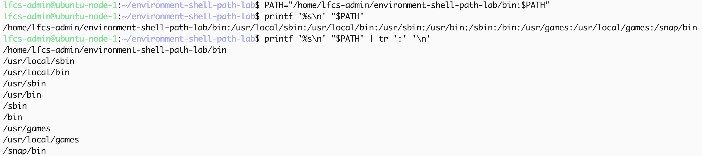

the lab `bin` directory appeared in the PATH

`command -v show-context.sh`, showed the absolute path to the `show-context.sh` script

`type show-context.sh`, showed that the `show-context.sh` resolved to the executable file

`show-context.sh`, is executable from any working directory

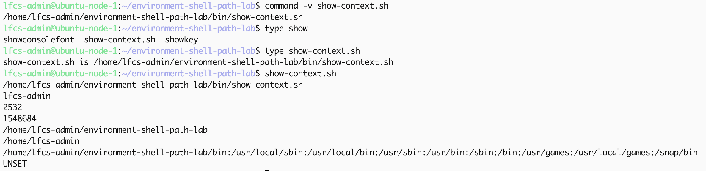

Bash performs PATH based command lookup, because the lab `bin` absolute path is present it is able to look into the bin directory and execute the script

The script itself remains unchanged, its location and permissions are not modified

### Prepend vs append

I restored PATH to its original state using the back up saved with: `export PATH=$(cat baseline/path-before-lab4.txt)`

prepend, places the lab `bin` directory at the top
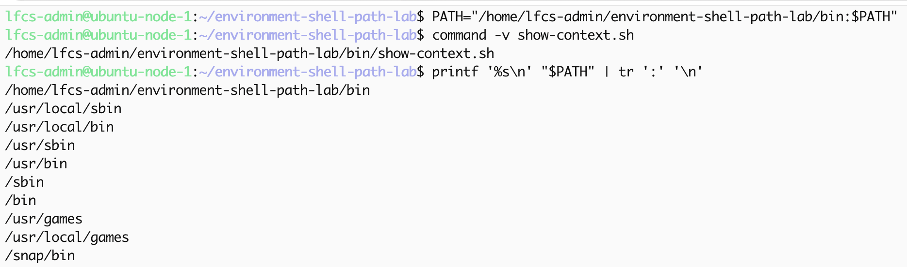

append places the lab `bin` directory at the bottom
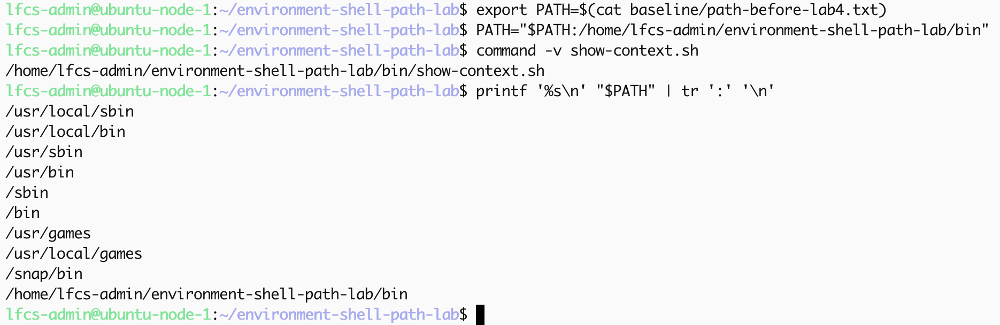

My hypothesis is that: if different directories contain executables to the same command name, the leftmost directory will be executed 1st by BASH

### Command precedence

restored PATH to its original state

created a secondary script with the same command name
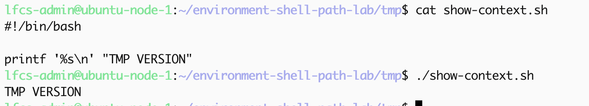

PATH ordering A:
lab/bin directory is placed before tmp, 

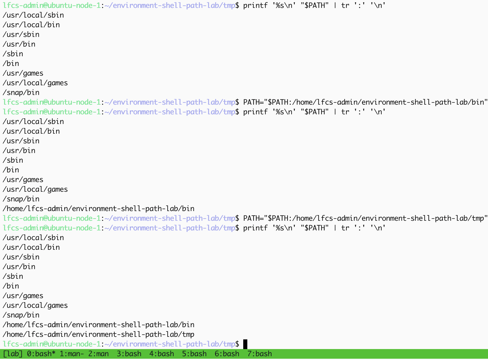
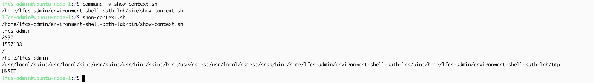

PATH ordering B:
tmp directory is placed before lab/bin:

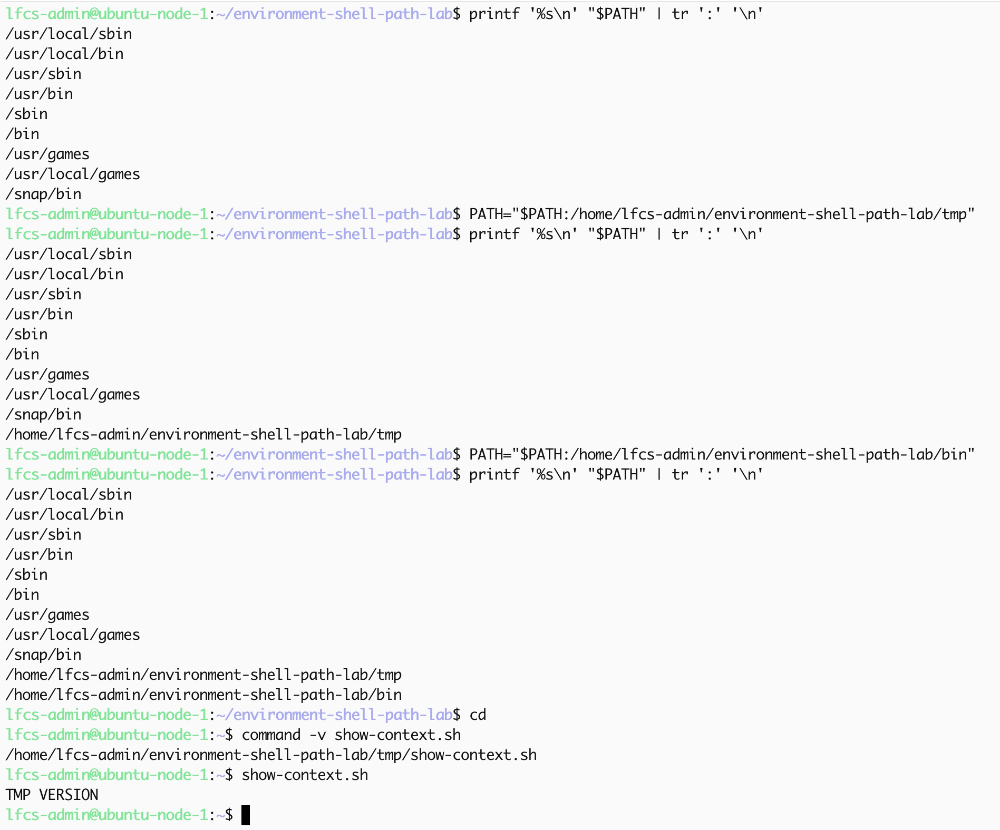

BASH chooses the upper directory because it comes first. PATH resolves the first closest match.  This can be become a security risk if a malicious PATH with the same command name is injected earlier, the malicious PATH would be looked up by BASH before.

### Bash command hashing

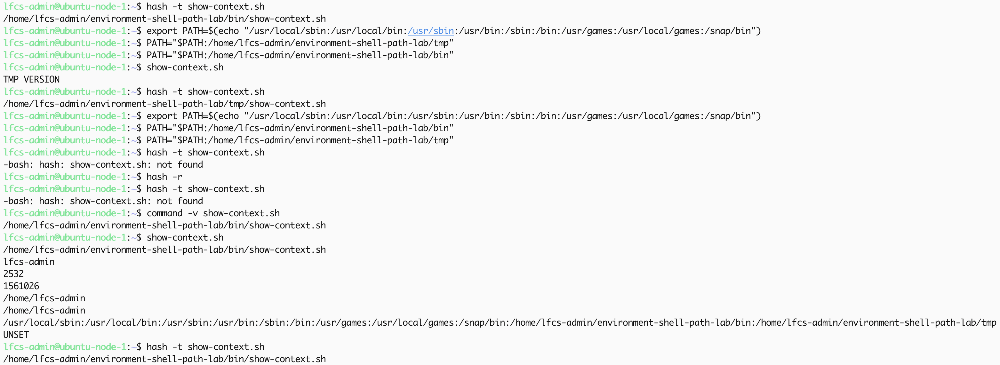

BASH caches the resolved pathname linked to the command name that has just been used. When I edit the PATH, the cache is cleared and `hash -t` outputs `-bash: hash: show-context.sh: not found` 

### Temporary vs persistent behaviour

I split my tmux terminal in half to confirm wether the changes to PATH are still present.

I confirmed that the changes to PATH were temporary because the changes to PATH have not been exported.

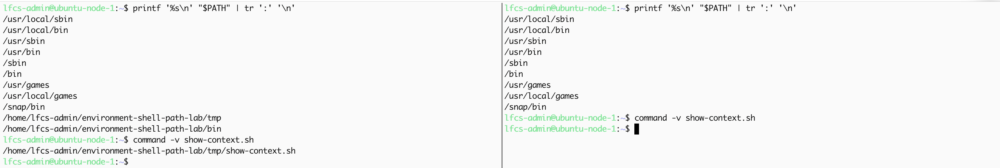

### broken shell 

I accidentally wiped my PATH while attempting to restore its original configuration.

This happened because I attempted to export the backup using a relative path while I was at the root of the system. the command `cat baseline/path-before-lab4.txt` produced the error  `No such file directory` to `stderr`.

Because the command substitution captures `stdout` the command became `export PATH=`; hence my shell PATH was emptied.

I was able to restore it using `export PATH=$(echo "/usr/local/sbin:/usr/local/bin:/usr/sbin:/usr/bin:/sbin:/bin:/usr/games:/usr/local/games:/snap/bin")`

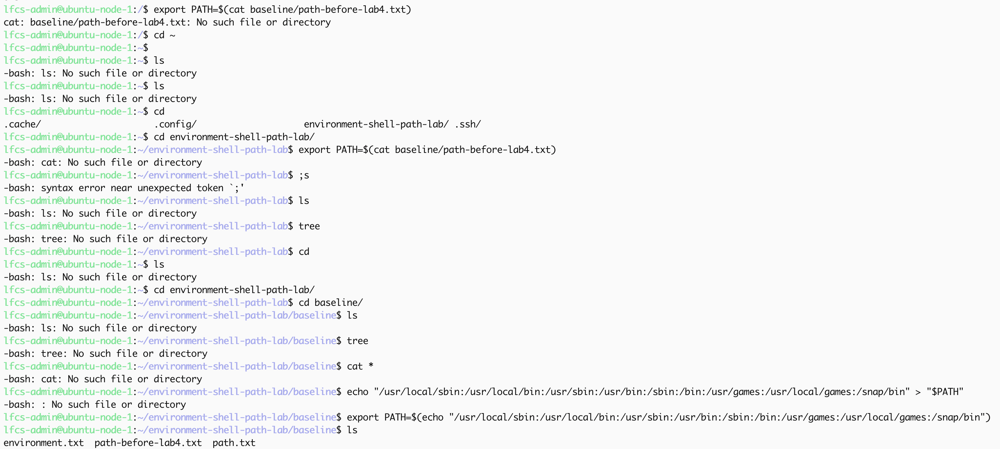