# logs & journalctl lab

## Goal

To understand how to use logs as evidence of events that have occured in the system. 
Iterpret state and logs from `systemctl status <service>` and `journalctl -u <service`.  
Filtering and narrowing scope to reduce noise, and prove that no entries does not mean nothing happened.

#### Service status vs Journal logs

I used "ssh.service" because the system already had SSH activity

confirmed state and logs using `systemctl status ssh.service --no-pager` 

output showed:
the service state was active(running), the main PID: 885, which is the main ssh listener tracked by systemd 

logs of recent journal entries related to the unit including:  
`Accepted publickey for lfcs-admin` 
`pam_unix(sshd:session): session opened`

these are SSH authentication and PAM session events, the list does not prove that there is still active ssh sessions. The logs show events proving that it happened.

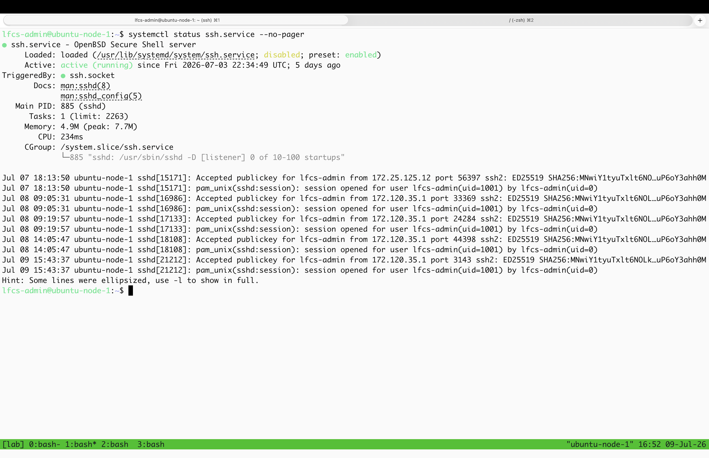

I then ran `journalctl -u ssh.service -n 20`

This showed recent(last 20) journal entries associated to `ssh.service` 

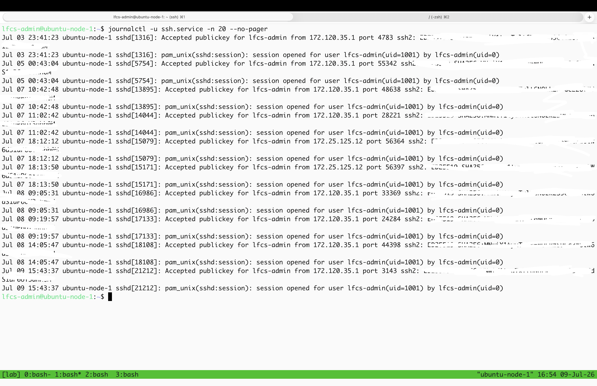

the difference between the two queries is that

`systemctl status ssh.service` shows the current unit state and recent related logs

`journalctl -u ssh.service` shows journal entries specific to that unit

#### wrong filter applied

I intentionally ran:
"journalctl --user-unit=sshd" 

this returned `No entries`
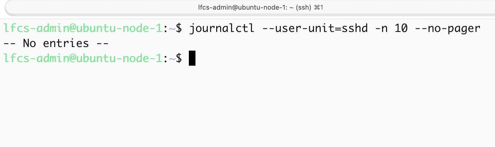

this filter is wrong because:
`--user-unit=sshd` searches user-scoped systemd units. SSH is running as a system service unit, not as a user session unit.

I then ran:

`journalctl -u ssh.service` 
this returned  SSH authentication and session logs.

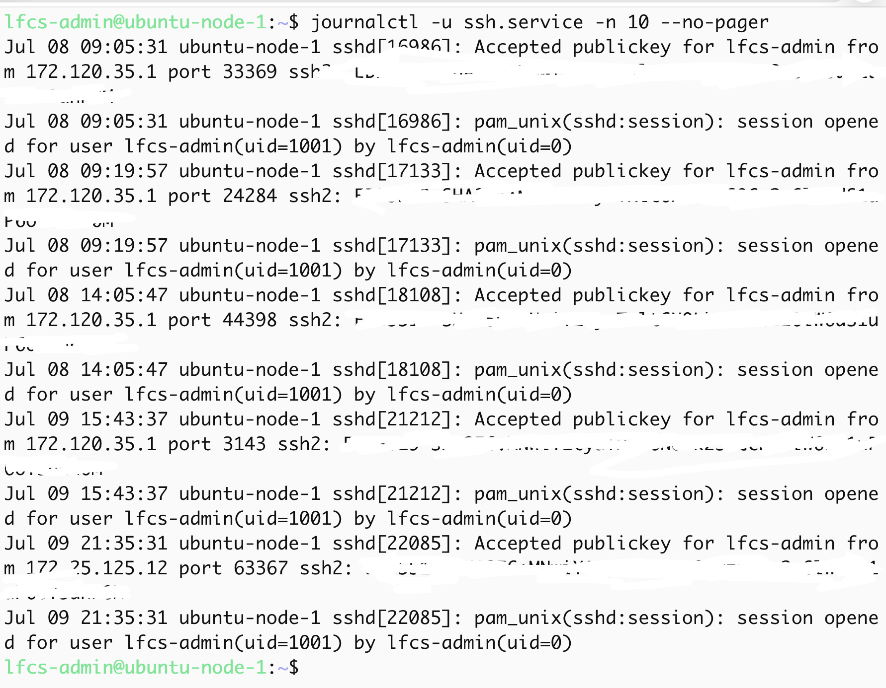

The difference is:

`ssh.service` is the systemd unit name

`sshd` is the daemon/process name

`--user-unit` searches user-scoped units 
`-u ssh.service` filters journal entries for the system service unit.

#### Live logs

To view live logs from the ssh service I ran: `journalctl -u ssh.service -f`, it shows previous events as well as live events. 

I ssh into the same VM from another terminal window, two events occurred:

`Accepted publickey for lfcs-admin` and `pam_unix(sshd:session): session opened`

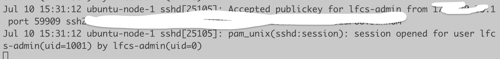

I then performed `sudo systemctl reload ssh.service` 

this runs the unit's ExecReload actions:
1. /usr/sbin/sshd -t, this validates ssh daemon configuration.
2. kill -HUP $MAINPID sends SIGHUP to the main sshd process. Causing sshd to reload configuration without a full service restart.

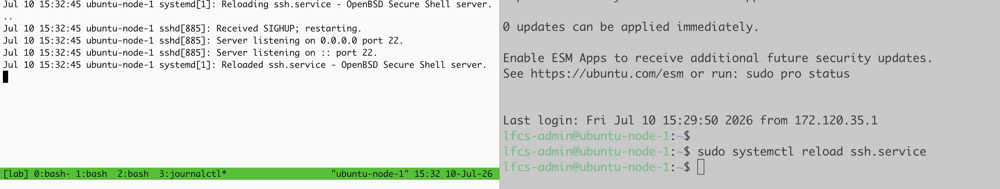

I then ran `sudo systemctl restart ssh.service`:

The logs showed a different lifecycle:

- sshd received signal 15 / SIGTERM
- ssh.service deactivated successfully
- ssh.service stopped
- ssh.service started again
- sshd began listening on port 22 again for IPv4 and IPv6

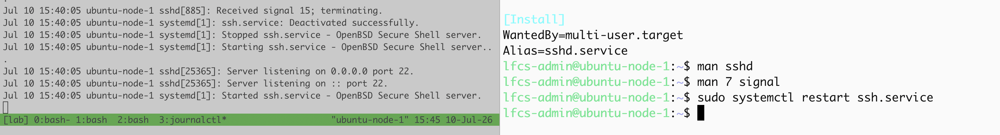

I checked the service status:

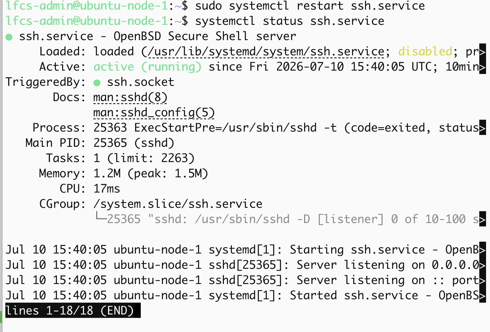

The ExecStartPre validation process was PID 25363 
The MAIN PID was 25365 
The previous MAIN PID was 885

`reload` and `restart` behave differently: 

`reload` keeps the daemon running and reloads the configuration, it avoids stopping and replacing the main daemon process. It did not disconnect the session because it signalled the main sshd listener to reload configuration without replacing the session process.

`restart` stops and starts the service creating a new MAIN PID, this creates a higher lockout risk, especially if the new configuration is broken or remote access depends on the service coming back cleanly; in this lab `restart` did not disconnect my existing SSH session because sshd session child processes can remain separate from the main listener, and this unit uses behaviour that does not necessarily kill every existing session. 

#### Time filtering

I ran log filtering based on different time windows

last hour logs:
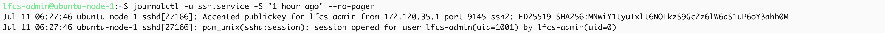

the "1 hour ago" query used the smallest time window

today's logs:
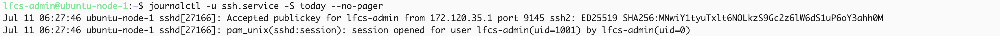

logs on the 10th of july (full 24hr)
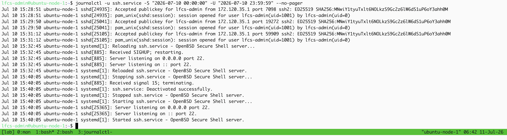

the explicit 24hr time window for 10th of July showed the largest time range for this lab

using `--since` during an incident narrows down to the period when the issue started, reducing noise and making it easier to connect symptoms to events. 

If the time window is wrong it can hide relevant evidence, return no entries, or show unrelated events that mislead troubleshooting.

#### Priority/Severity filtering

I ran `journalctl -u ssh.service -p warning..alert -n 20 --no-pager`, the query showed no entries in that query scope.

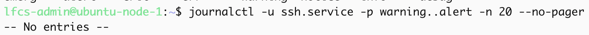

I ran `journalctl -p err -n 20 --no-pager`, this returned several system-wide errors, including failed services, sudo/PAM errors, systemctl bus connection failures, and kernel messages.

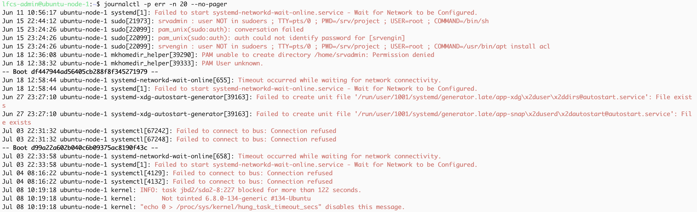
This command was not scoped to `ssh.service`, so it searched the wider system journal.

I ran `journalctl -p warning..alert --since today --no-pager`, to check warning to alert logs, this returned no entries:

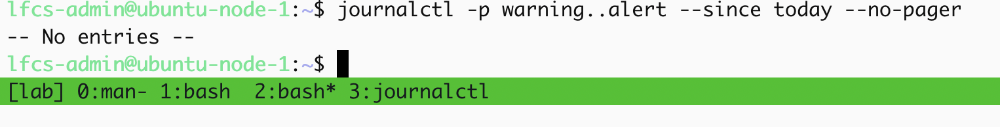

No entries means there were no matching visible journal entries for that unit filter, priority range, time window, permissions, and journal retention. It does not prove that no event ever happened.

Severity levels:

0 emerg
1 alert
2 crit
3 err
4 warning
5 notice
6 info
7 debug

The lower the number means more severe

Severity filtering is useful during troubleshooting because it reduces noise.

#### controlled service failure

I re-created the `reload-drill.service` and deliberately broke it by the `ExecStart` line to:

`ExecStart=/not/a/real/command`

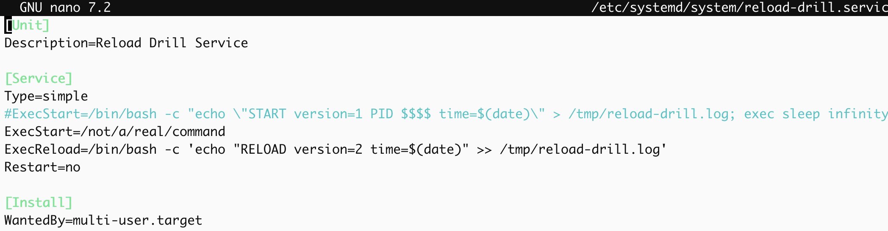

After editing the unit's file I ran: `systemctl daemon-reload`

then I tried to restart the service:

`sudo systemctl restart reload-drill.service`

The service entered a failed state.

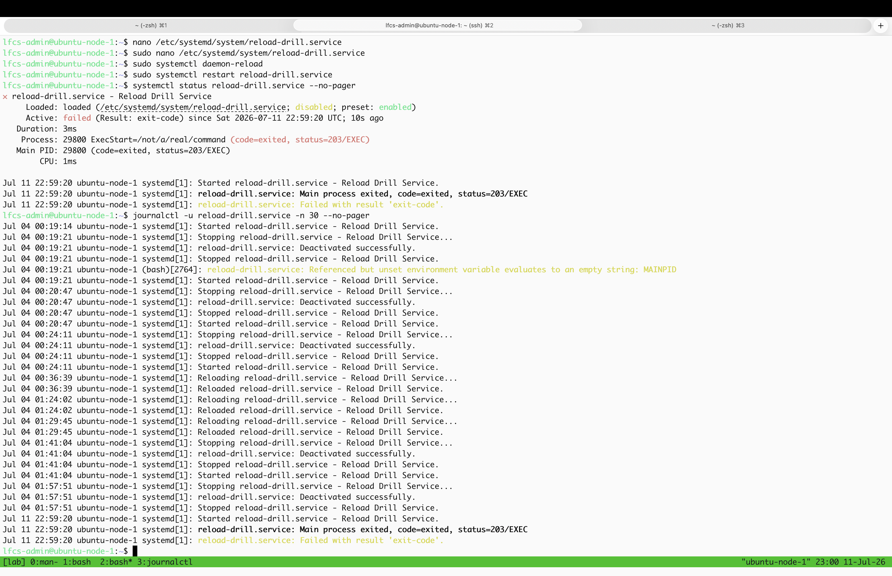

`systemctl status reload-drill.service --no-pager` showed:

`Active: failed (Result: exit-code)`

The key evidence line was:
`Process: 29800 ExecStart=/not/a/real/command (code=exited, status=203/EXEC)`

This showed that systemd tried to execute `/not/a/real/command`, but it could not be executed.

`status=203/EXEC` means systemd could not execute the command defined in `ExecStart`

The root cause was a misconfigured `ExecStart` path.

To fix it, I restored the original `ExecStart` command, ran `systemctl daemon-reload`, and restarted the service.

#### second failure: unit file quote error

While restoring the service, I introduced another syntax error by breaking the quote structure in the `ExecStart` line. 
When restarting the service, systemd returned:
`Failed to restart reload-drill.service`
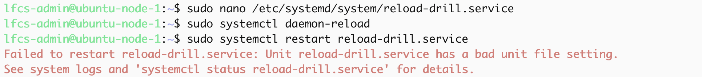

I checked the journal for logs:
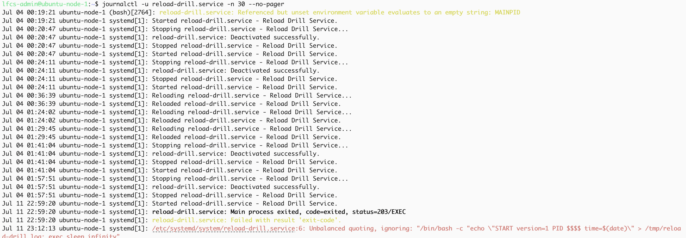

The journal showed `Unbalanced quoting`, this meant systemd could not parse the unit's file because the quoting was invalid.

I also noticed that I only used one `>` instead of `>>` , this would overwrite the file instead of appending.

I corrected the `ExecStart` line:
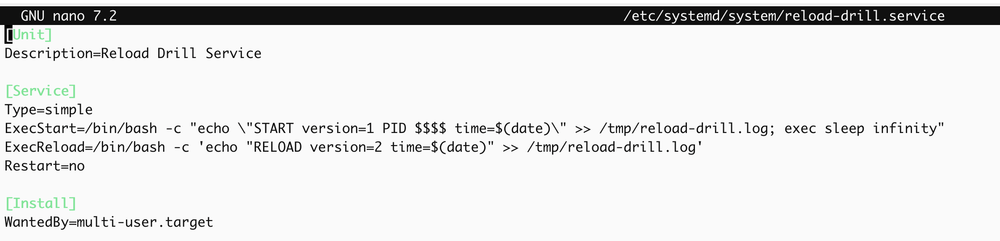

ran:

`sudo systemctl daemon-reload`

Then restarted the service:

`sudo systemctl restart reload-drill.service`

Finally, I verified recovery with:

`systemctl status reload-drill.service --no-pager`

The service returned to:

`active (running)`

The log file also showed new `START` and `RELOAD` entries, proving the service was working again.
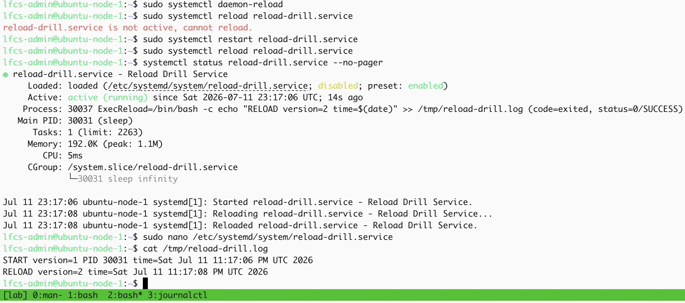

`systemctl status` shows the current service state and high-level failure reason.

journalctl shows the detailed timeline and error evidence.

status=203/EXEC means systemd could not execute the configured `ExecStart` command.

A bad unit file setting means systemd could not correctly parse or apply the unit file.

`daemon-reload` is required after editing a unit file so systemd reloads its unit definition from disk.

Troubleshooting flow:
observe status → inspect journal → identify evidence line → fix root cause → daemon-reload → restart → verify active state

#### grep and journal output

I used `grep` to filter `journalctl` output for specific ssh log patterns. 
`journalctl -u ssh.service -n 50 --no-pager | grep -i "accepted"`

This returned log lines containing: 
`Accepted publickey for lfcs-admin`

These entries show successful SSH public key authentication.
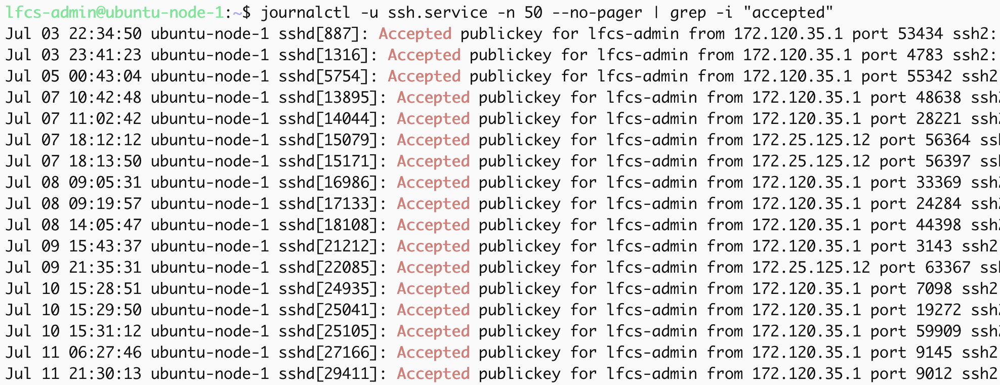

To find PAM session creation events, I ran: 
`journalctl -u ssh.service -n 50 --no-pager | grep -i "session opened"`

This returned log lines containing: 
`pam_unix(sshd:session): session opened`
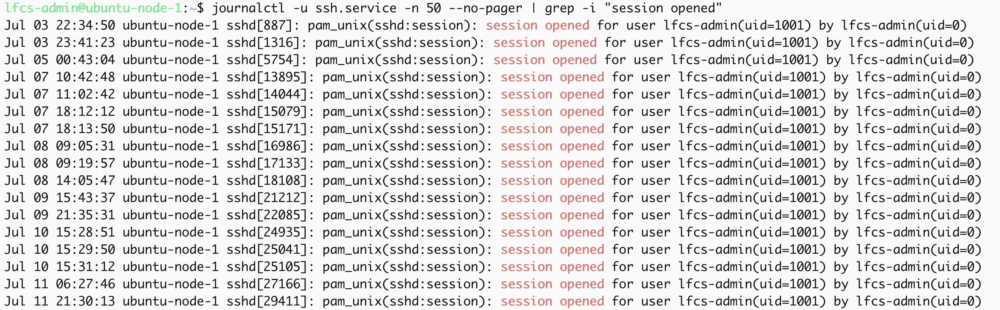
These entries showed that PAM opened SSH login sessions.

To count accepted public key authentication events, I ran: 
`journalctl -u ssh.service -n 50 --no-pager | grep -i "accepted" | wc -l`

The output was: 
`17`
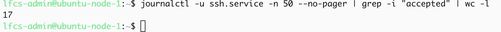

This means there were 17 matching `accepted` log lines within the last 50 journal entries for `ssh.service`.

`grep` is useful with `journalctl` because it reduces noise and helps isolate specific patterns during troubleshooting.

The risk of filtering too narrowly is that relevant evidence may be hidden. No output means no matching visible entries for that query, it is not proof that nothing happened.

## Final Mental Model

`systemctl status` shows the current state of a unit and recent related log entries.

`journalctl` queries the systemd journal.

`journalctl -u <unit>` filters logs for a specific systemd unit.

`--user-unit` searches user-scoped units, which is different from system service units.

`-f` follows logs live.

`--since` and `--until` narrow the time window.

`-p` filters by priority/severity.

No output means no matching visible entries for the query. It does not prove that nothing happened.

During troubleshooting, logs should be used as evidence to confirm or reject a hypothesis.