# Navigation and Filesystem Operations Lab

The goal is to build evidence that I understand:
- absolute and relative paths
- path resolution
- directory entries vs directory contents
- safe use of `mkdir`, `touch`, `cp`, `mv` and `rm`
- verification before destructive operations

## Path Resolution 

### Lab environment

In this lab I created a directory with subfolders and files, the structure and contents can be found [here](./fixtures/navigation-filesystem-lab/)

I used `mkdir -pv navigation-filesystem-lab/{apps/{api/config,web/public},archive,incoming,reports}` to create the skeleton of the directory

`mkdir` creates directories
`-p` does not report an error when a directory already exists and creates missing parent directories as needed.

`-v` is verbose, it will print a message for each directory created

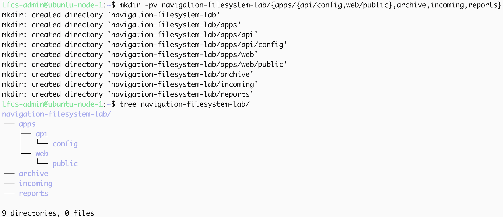

The `{}` is the shell's brace expansion which allows creation of subfolders.

I validated and confirmed the directory's creation by using:
- `ls -lai navigation-filesystem-lab` 
`-l` lists the long format
`-a` does not ignore entries that start with `.`
`-i` prints the inode number of each file

- `tree navigation-filesystem-lab`
- `find navigation-filesystem-lab`

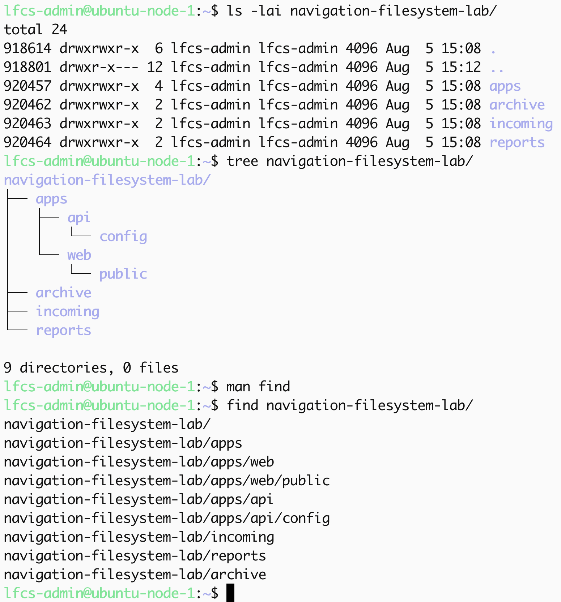

I proceeded to populate the directory with files, for this is use the `touch` command, and validate using `tree` and `ls -a`:

`touch` creates an empty file when the pathname does not exist; If it already exists the timestamps are updated, no new file will be created.

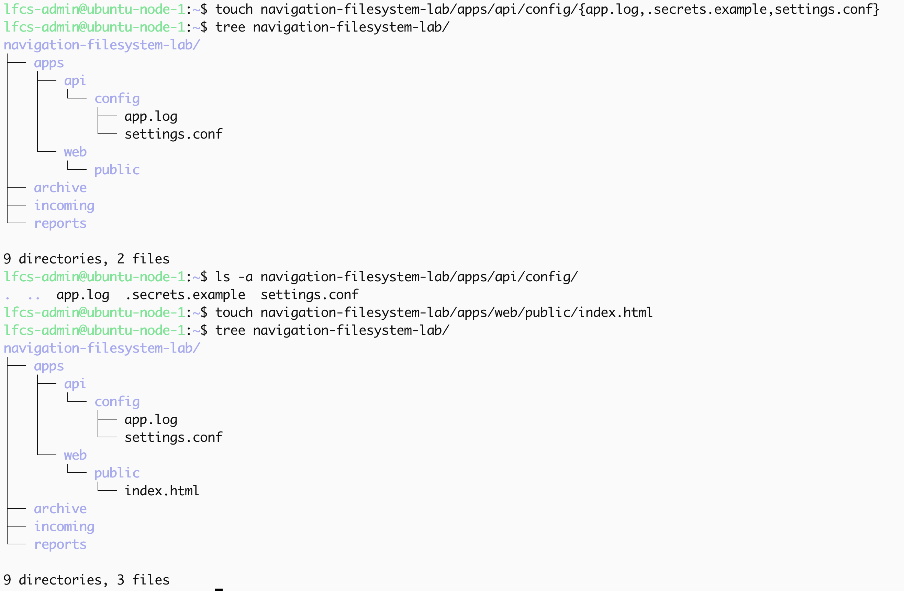
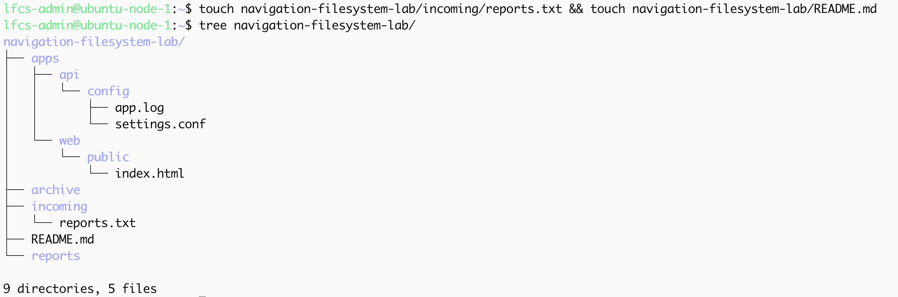

Final directory structure for the lab:

### current working directory

`.` is the current folder
`..` is the parent folder
`/` is the system root
`~` is expanded by the shell into the current user's home directory

`pwd` prints the absolute path of the current working directory

`ls` lists the contents of the current directory.

the flags:
- `-l` lists long format
- `-d` causes `ls` to list a directory as an entry rather than the contents inside it
- `-a` does not ignore files starting with `.`.

`ls -ld .` lists the current working directory itself whereas `ls -a .` lists all the contents within the current working directory.

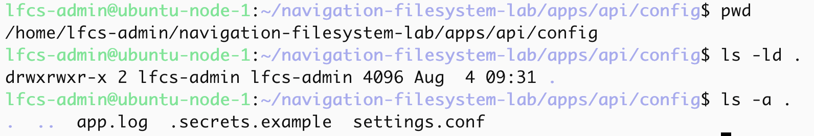

### Directory entries vs directory contents

A directory contains entries that that are associated with the inode numbers. `ls` lists those entries. A file's inode refers to the its metadat and data blocks. Renaming a file changes the pathname entry; it does not rewrite the file's contents.

### parent navigation

to list the contents of the parent directory I used `ls ..`

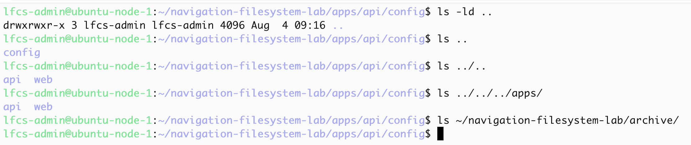

### absolute vs relative vs home-expanded

I used three ways to inspect the archive directory:

absolute path: `ls /home/lfcs-admin/navigation-filesystem-lab/archive/`
relative path: `ls ../../../archive/`
home-expanded: `ls ~/navigation-filesystem-lab/archive/`

`tree` is another program that I regularly use to confirm and validate the structure of directories and contents: 

### Controlled failure

the current working directory was `/home/lfcs-admin/navigation-filesystem-lab/apps/api/config`

I used `ls ../../archive`, this did not work because `archive` is not in the `apps` folder  where `../../` points to.

I confirmed the contents of `../../`, only `api` and the `web` directories were listed.

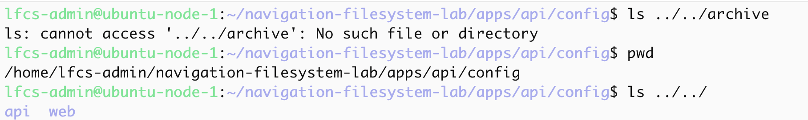

the correct relative path is one level above `apps`, `../../../archive`

## Copy, move and rename

`cp settings.conf ~/navigation-filesystem-lab/archive/settings.conf.bak`, creates a separate  file at another destination under a new pathname and copies the source contents into it, the original pathname remains unchanged.

`mv app.log ~/navigation-filesystem-lab/reports/api-startup.log` both moves and renames the pathname.
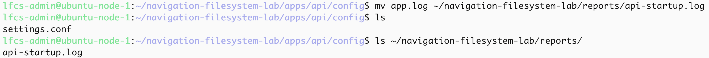 

`mv .secrets.example .env.example` on the same filesystem `mv` can rename the directory entry without copying the file data. accross filesystems `mv` copies the file data and metaddat to the destination and removes from the source after the copy succeds.
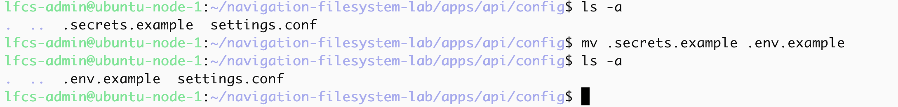

## Safe deletion

my current working directory was `/home/lfcs-admin/navigation-filesystem-lab/apps/api/config`

I carried out checks in the `~/navigation-filesystem-lab/incoming` directory to ensure that the `report.txt` file was present before deleting it.
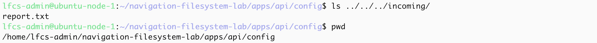

Confirmed the target's metadata and entry

I used a relative path to delete the file `rm ../../../incoming/report.txt`
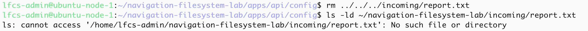

`rm` removes non-directory entries by default, the `incoming` directory should still exist. `rm -r`  recursively removes a directory tree, while `rmdir` removes an empty directory.

I confirmed that the file had been removed and proved that the `incoming` directory still existed by using the `ls` and `tree` programs.

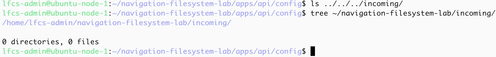