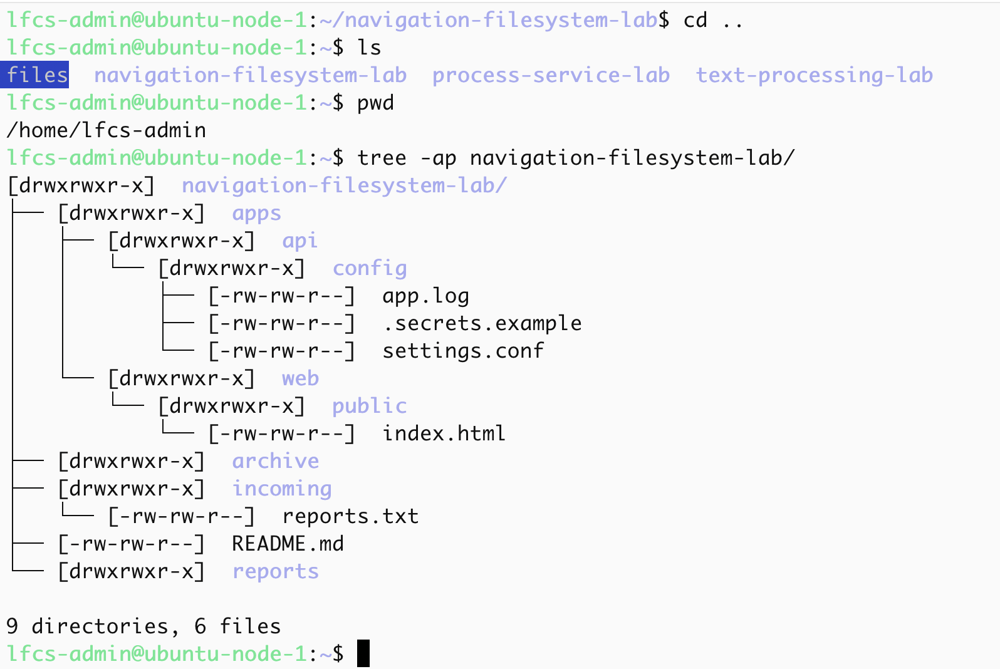
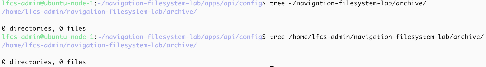
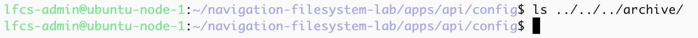
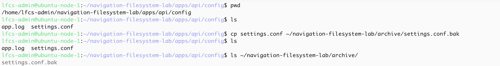
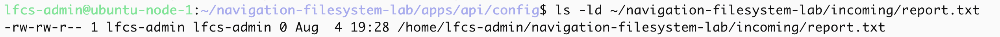

# Navigation and Filesystem Operations Lab

The goal is to build evidence that I understand:
- absolute and relative paths
- path resolution
- Directory entries vs directory contents
- safe use of `mkdir`, ` touch`, `cp`, `mv` and `rm`
- verification before destructive operations

## Path Resolution 

### Lab environment

In this lab I created a directory with subfolders and files, the structure and contents can be found [here](/phase-01-linux-foundations/navigation-filesystem-operations/fixtures/)

### current working directory

`.` is the current folder
`..` is the parent folder
`/` is the system root
`~` is the home folder

`pwd` prints the absolute path of the current working directory

`ls` lists directory contents

the flags:
- `-l` lists long format
- `-d` lists directories entries
- `-a` does not ignore files starting with `.`.

`ls -ld .` lists the current working directory itself whereas `ls -a .` lists all the contents within the current working directory.

### parent navigation

to list the contents of the parent directory I used `ls ..`

### absolute vs relative vs home-expanded

These are the two ways I used to inspect the archive directory:

absolute path: `ls /home/lfcs-admin/navigation-filesystem-lab/archive/`
relative path: `ls ../../../archive/`
home-expanded: `ls ~/navigation-filesystem-lab/archive/`

### Controlled failure

the current working the directory was `/home/lfcs-admin/navigation-filesystem-lab/apps/api/config`

I used `ls ../../archive`, this did not work because `archive` is not in the `apps` folder  where `../../` points to.

I confirmed the contents of `../../`, only `api` and the `web` directories were listed.

the correct relative path is one level above `apps`, `../../../archive`

## Copy, move and rename

`cp settings.conf ~/navigation-filesystem-lab/archive/settings.conf.bak`, creates a separate  file at another destination under a new pathname and copies the source contents into into it, the original pathname remains unchnaged.

`mv app.log ~/navigation-filesystem-lab/reports/api-startup.log` both moves and renames the pathname.
 

`mv .secrets.example .env.example` renames the the directory entry

## Safe deletion

my current working directory was `/home/lfcs-admin/navigation-filesystem-lab/apps/api/config`

I carried out checks in the `~/navigation-filesystem-lab/incoming` directory to ensure that the `report.txt` file was present before deleting it.

Confirmed the targets metadata and entry

I used a relative path to delete the file `rm ~/navigation-filesystem-lab/incoming/report.txt`

`rm` removes files or directories, the `incoming` directory should still exist. if I wanted to destroy the directory as well I would add the `-r` flag.

I check that the file no longer exist and proved that the `incoming` directory still existed by using the `ls` and `tree` programs.

