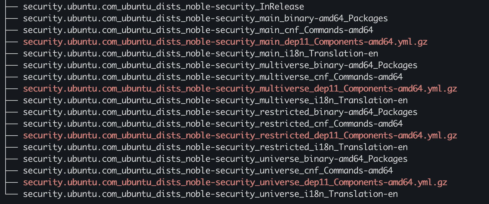
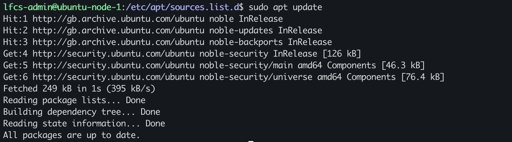

# APT Repositories, Sources & Trust

## VM's repository configuration
APT source configuration location:

`/etc/apt/source.list.d/`

configuration file:
`ubuntu.sources`

Configured source 1:

Format:
deb822 (.sources)

URI:  `http://gb.archive.ubuntu.com/ubuntu/`
Suites: `noble noble-updates noble-backports`
Components: `main restricted universe multiverse`
Signing/keyring: `/usr/share/keyrings/ubuntu-archive-keyring.gpg`

Configured source 2:

Format:
deb822 (.sources)

URI:  `http://security.ubuntu.com/ubuntu/`
Suites: `noble-security`
Components: `main restricted universe multiverse`
Signing/keyring: `/usr/share/keyrings/ubuntu-archive-keyring.gpg`

My explanation:
When `apt update` executes, the local APT metadata's indexes are refreshed,  APT fetches and refreshes the locally stored repository indexes/metadata with the most recent updates found on the remote repositories.

`URI`: identfies the repository which APT looks into
`suite`: specifies the distribution/archive such as `noble`, `noble-updates` or `noble-security`,
`components`: partitions the archive

## APT local index information & cached packages

index files after apt update are stored in: `/var/lib/apt/lists/`

cached packages are stored in: `/var/cache/apt/archives/`

`noble-security` is a suite, the entries within `/var/lib/apt/lists/` that correspond to it are:

## Trust

`InRelease` is the signed archive, this is verified by the `Signed-By` keyring, this carries out a signature check.

A trusted public is used from the configured keyring, apt uses his to verify that the repository InRelease metadata was signed by an expected repository signing key and no alteration has occurred since signing. 

If alteration has occured after signing the calculated hash will not match the authenticated has in InRelease, the verification will fail and APT will reject the untrusted metadata.

## controlled repository failure

created a backup for `ubuntu.sources`
I modified the URI by removing a `.`

Predicted symptom:

Apt will not be able to retrieve metadata for noble-security, other repositories still might

Rollback:
restore ubuntu.sources from backup

### observation 

`$ sudo apt update
Ign:1 http://security.ubuntucom/ubuntu noble-security InRelease
Hit:2 http://gb.archive.ubuntu.com/ubuntu noble InRelease
Get:3 http://gb.archive.ubuntu.com/ubuntu noble-updates InRelease [126 kB]
Get:4 http://gb.archive.ubuntu.com/ubuntu noble-backports InRelease [126 kB]
Get:5 http://gb.archive.ubuntu.com/ubuntu noble-updates/main amd64 Packages [1,260 kB]
Get:6 http://gb.archive.ubuntu.com/ubuntu noble-updates/main amd64 Components [181 kB]
Get:7 http://gb.archive.ubuntu.com/ubuntu noble-updates/restricted amd64 Packages [1,536 kB]
Get:8 http://gb.archive.ubuntu.com/ubuntu noble-updates/universe amd64 Packages [1,690 kB]
Get:9 http://gb.archive.ubuntu.com/ubuntu noble-updates/universe amd64 Components [388 kB]
Get:10 http://gb.archive.ubuntu.com/ubuntu noble-updates/multiverse amd64 Components [940 B]
Get:11 http://gb.archive.ubuntu.com/ubuntu noble-backports/main amd64 Components [5,744 B]
Get:12 http://gb.archive.ubuntu.com/ubuntu noble-backports/universe amd64 Components [12.7 kB]
Ign:1 http://security.ubuntucom/ubuntu noble-security InRelease
Ign:1 http://security.ubuntucom/ubuntu noble-security InRelease
Err:1 http://security.ubuntucom/ubuntu noble-security InRelease
  Could not resolve 'security.ubuntucom'
Fetched 5,326 kB in 7s (752 kB/s)
Reading package lists... Done
Building dependency tree... Done
Reading state information... Done
All packages are up to date.
W: Failed to fetch http://security.ubuntucom/ubuntu/dists/noble-security/InRelease  Could not resolve 'security.ubuntucom'
W: Some index files failed to download. They have been ignored, or old ones used instead.`

the broken URI prevented APT from resolving to the ip address of the repository, network connectivity is functioning for the other repositories as `Get` and `Hit` are displayed in the output. 

`Err` shows the effects of he broken URI `Could not resolve 'security.ubuntucom'` pointing to a DNS name resolution issue. APT does not reach the path/suite or even check the signature/suite because it is not  able to connect to repo to begin with, integrity checks and path would be subsequent steps after repository reachability is confirmed.

`Ign` indicated that some indexes were ignored due to failed downloads

### Recovery

restored the `ubuntu.sources` file to its original state

and ran `sudo apt update`

`$ sudo apt update
Hit:1 http://gb.archive.ubuntu.com/ubuntu noble InRelease
Hit:2 http://gb.archive.ubuntu.com/ubuntu noble-updates InRelease
Hit:3 http://gb.archive.ubuntu.com/ubuntu noble-backports InRelease
Get:4 http://security.ubuntu.com/ubuntu noble-security InRelease [126 kB]
Get:5 http://security.ubuntu.com/ubuntu noble-security/main amd64 Components [46.3 kB]
Get:6 http://security.ubuntu.com/ubuntu noble-security/universe amd64 Components [76.4 kB]
Fetched 249 kB in 1s (395 kB/s)
Reading package lists... Done
Building dependency tree... Done
Reading state information... Done
All packages are up to date.`

### Incident Mental Model

Symptom: When running `apt update`, apt is unable to fetch from ` http://security.ubuntucom/ubuntu/dists/noble-security/InRelease`
Evidence: APT is unable to resolve. `'security.ubuntucom'`, `ign` and `err` printed out on the terminal
Hypothesis: APT attempts to resolve the URI for the security repository but it fails to resolve, indicating that there is DNS/name resolution issue. Other repositories are able to metadata retrieval.
Root cause: a typo in the URI, caused the name resolution to fail preventing metadata to be retrieved
Smallest change/rollback: used a previous back up with no typos
Verification: ran `sudo apt update`, no errors, local APT repository indexes\metadata up to date with repositories

