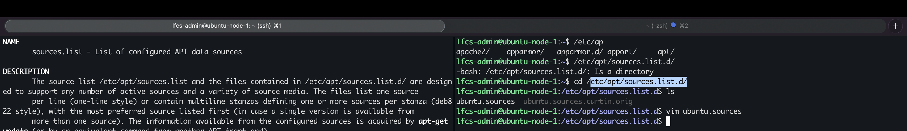
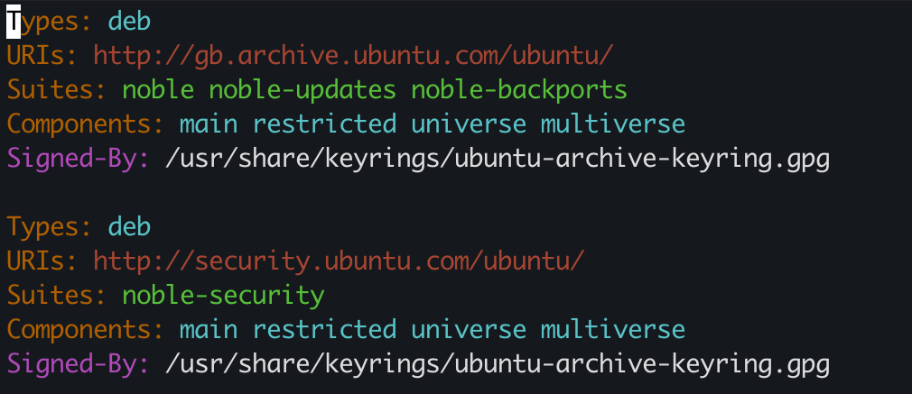

# APT Repositories, Sources & Trust

## VM's repository configuration
APT source configuration location:

`/etc/apt/source.list.d/`

configuration file:
`sources.list`

Configured source 1:
Types: `deb`
URI:  `http://gb.archive.ubuntu.com/ubuntu/`
Suites: `noble noble-updates noble-backports`
Components: `main restricted universe multiverse`
Signing/keyring: `/usr/share/keyrings/ubuntu-archive-keyring.gpg`

Configured source 2:
Types: `deb`
URI:  `http://gb.archive.ubuntu.com/ubuntu/`
Suites: `noble-security`
Components: `main restricted universe multiverse`
Signing/keyring: `/usr/share/keyrings/ubuntu-archive-keyring.gpg`

My explanation:
When `apt update` executes, the local APT metadata's indexes are refreshed,  APT overwrites the local cache with the most recent updates found on the remote repositories.

`URI`'s: are the link to the repository which APT looks into
`suite`: specifies the path within URI
`components`: subset of the specified URI

