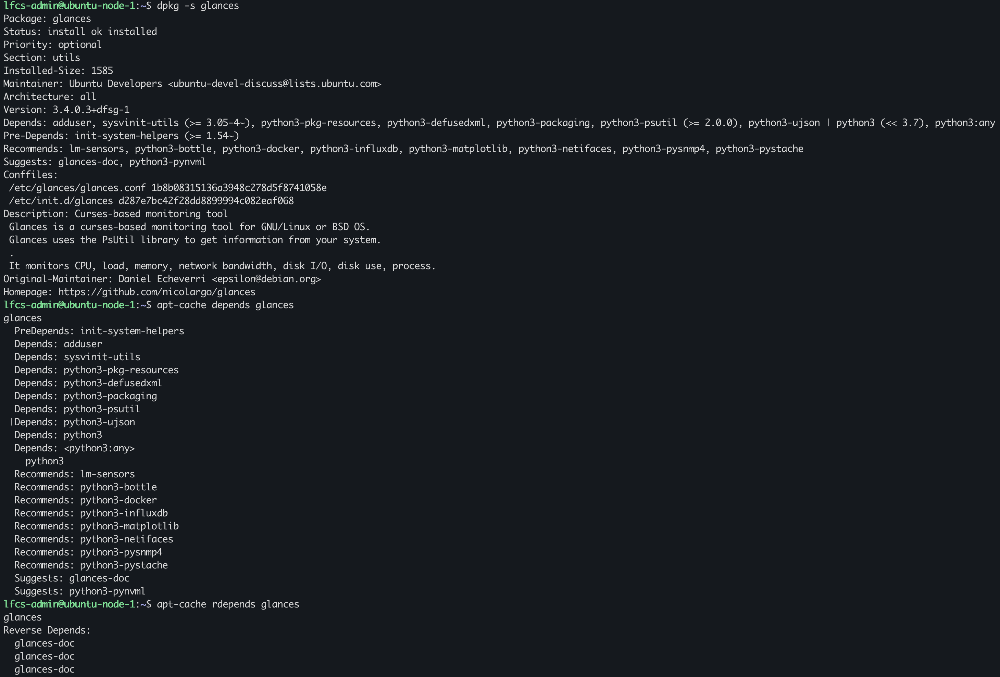
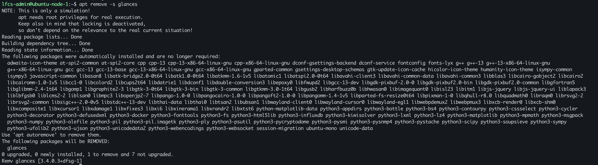
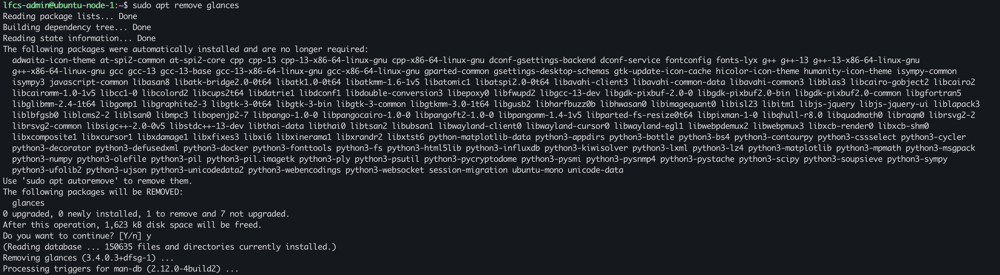
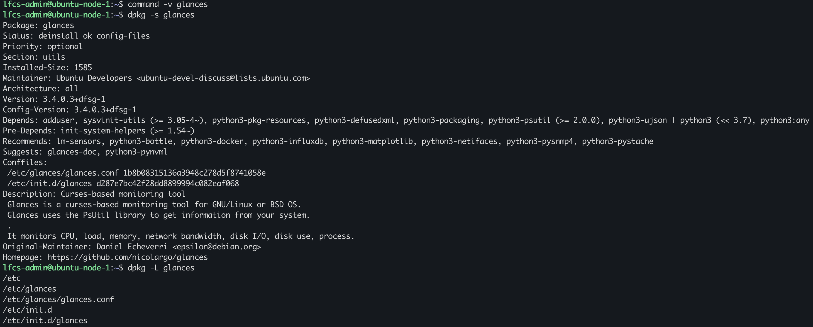
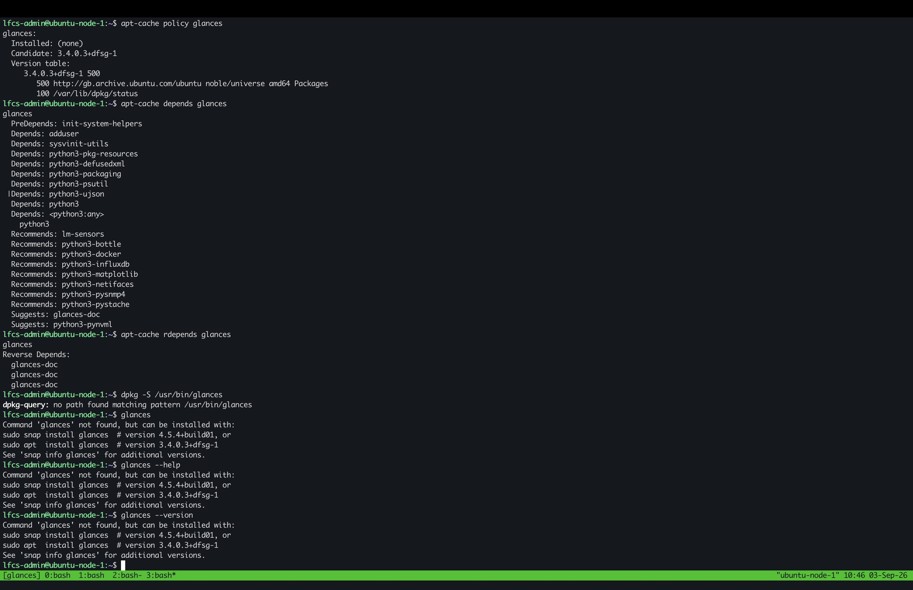
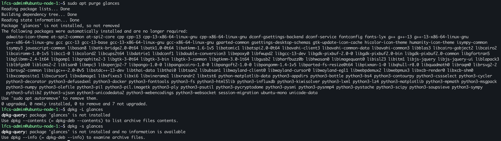
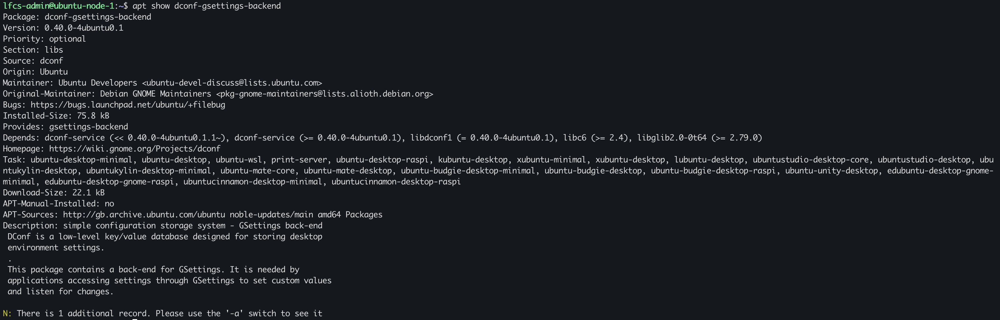
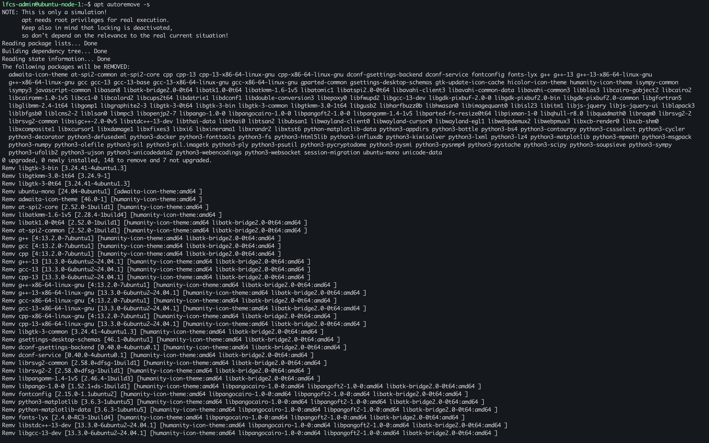

# Dependencies, Reverse Dependencies, Remove, Purge, and Autoremove

### Inspect package before removal

Establish that the package is installed, what are the package dependencies? What does the package depend on?

Does APT recognise the package as installed?

What metadata does the package show?

### predict what happens before removing package

all directories/entries displayed by `dpkg -L glances` will be removed including `/usr/bin/glances` and `etc/glances/glances.conf`

packages that were installed because only glances needed will be removed

applications/packages installed because Glances needed will not be removed if another application does needs them

### Simulate package removal

Before procesding with the package removal, I performed a dry run to inspect which pakcges would would be removed.
the automatically installed package are marked as no longer required and can be removed with `apt autoremove`. 

The system confirmed that only `glances` would be removed.

### Package removal

I proceeded to remove the package, some of the package configuration files remained

I verified the following:

Shell unable to resolve `glances`, meaning that the main executable have been removed
dpkg package status showing `deinstall ok config-files`, meaning it is not installed but it is keeping the configuration-file state.

APT installed state: `(none)`
candidate state `3.4.0.3+dfsg-1`

Configuration files were still present 

### Package purge

`apt purge glances` removed the packaged-managed conffiles and cleared the remnants of the package state.

### Comparing remove and purge

`apt remove <pkg>` removes package payload including executables, but keeps the package state for the remaining conffiles, whereas `apt purge <pkg>` clears dpkg's residual configuration state and conffiles left after removing a package.

This explain why the purge output says `Package 'glances' is not installed, so not removed`. `apt remove` uninstalls the package, `apt purge` subsequently removes any lingering metadata or conffile.

### Autoremove 

installing the package pulled in an additional 100 packages to be installed

`apt remove <pkg>` and `apt purge <pkg>` both displayed: 
`The following packages were automatically installed and are no longer required`

The package that was removed is the same package that pulled in an additional 100 packages were automatically installed packages that APT does not require, so APT marks them as removable. 

An automatic installed dependency can be removed with autoremove. However if the dependency was manually installed or marked as manual it will not be removed.

I randomly chose a dependent package: `dconf-gsettings-backend`

`apt autoremove -s dconf-gsettings-backend` caused an additional `148` packages to be removed because a package operand was passed, this tells APT to account for the defined package in the autoremove transaction, resulting in dependencies being recalculated, if the package sits in a wide dependency graph, its removal will force other removals.

`apt show dconf-gsettings-backend`

shows that `APT-Manual-Installed: no`, this was an automatic installation

`apt autoremove` removes packages that were automatically installed to satisfy dependencies of other packages and are now no longer needed.

The intended cleanup operation command was `apt autoremove` on its own.

Not using a dry-run/simulation could have resulted in unplanned system change.

`apt autoremove -s` proposed the removal of 148 packages, although I was expecting 100. `dconf-gsettings-backend` appears in the normal autoremove list. disk space reclaimed is not shown.
The `apt autoremove` operand is the correct command to use because the plan was to remove the pakages that APT condsiders automatically installed and no longer needed.

