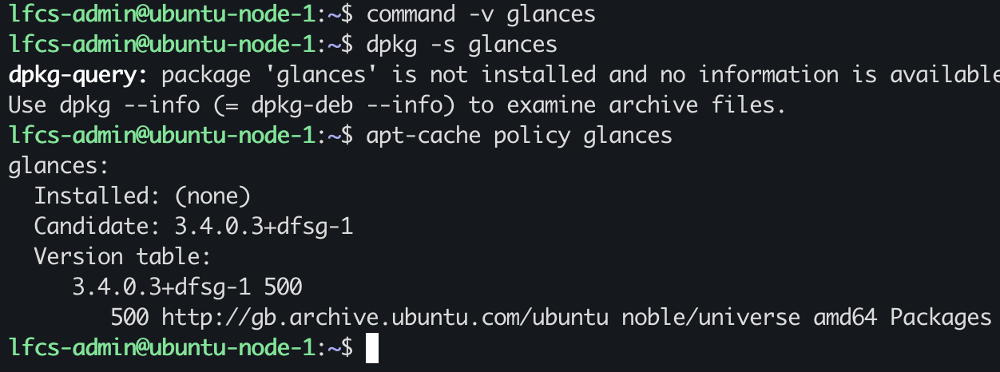
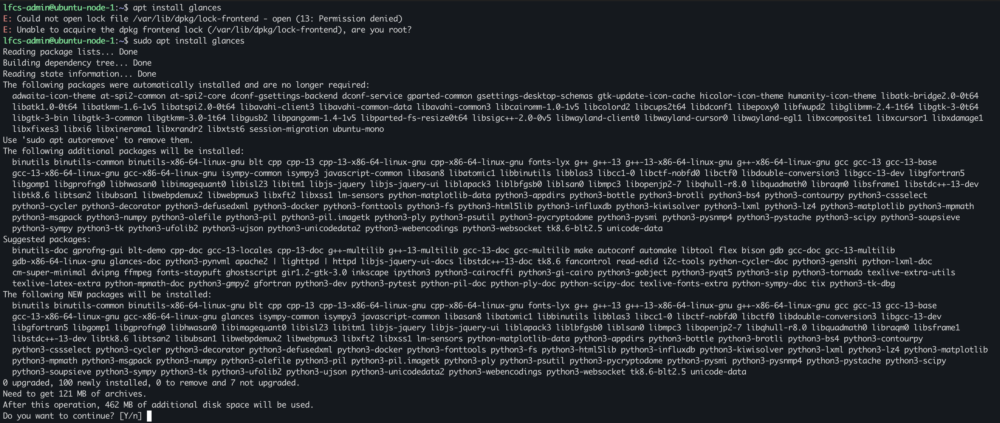
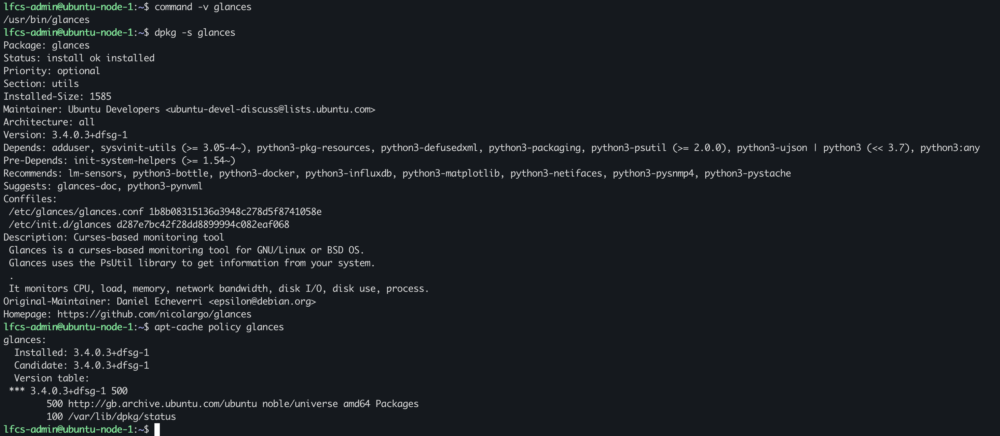
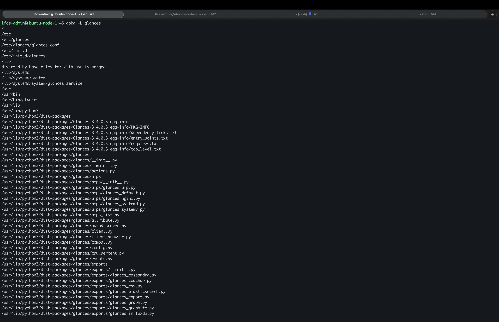
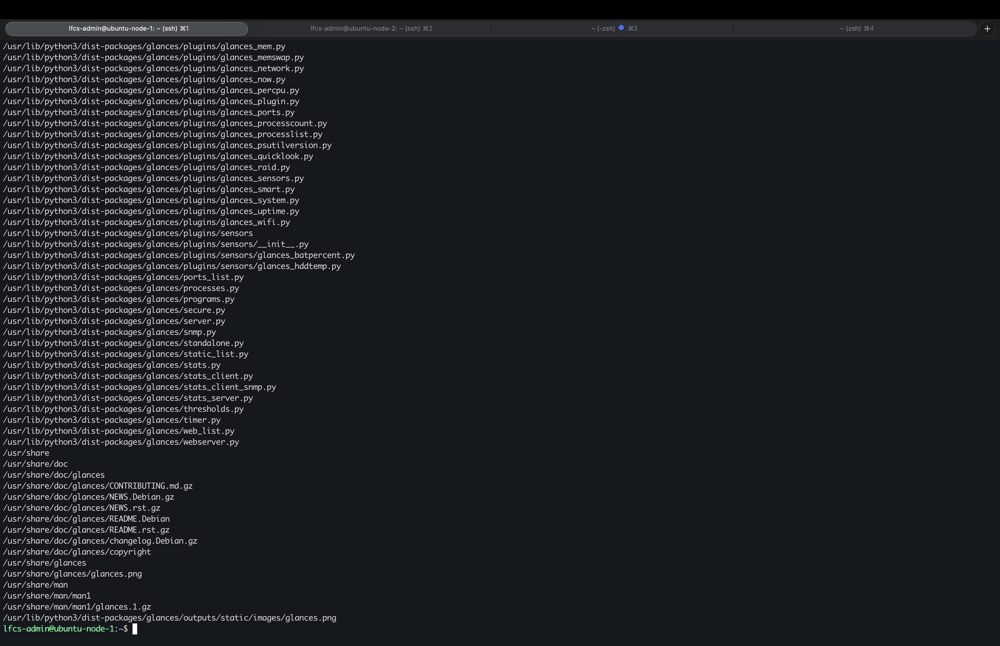
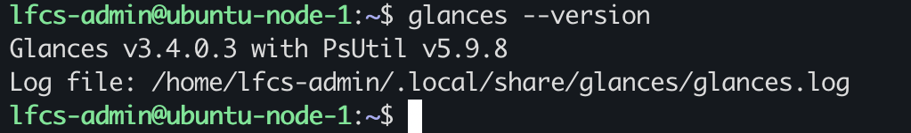
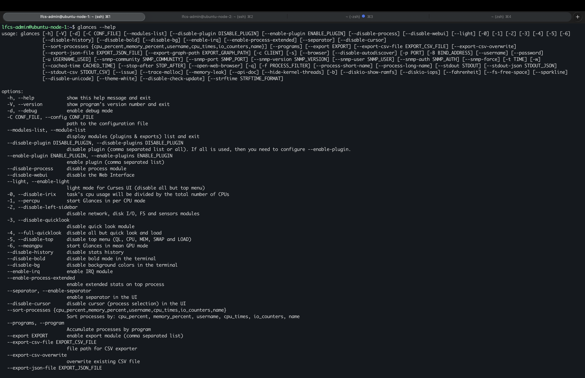
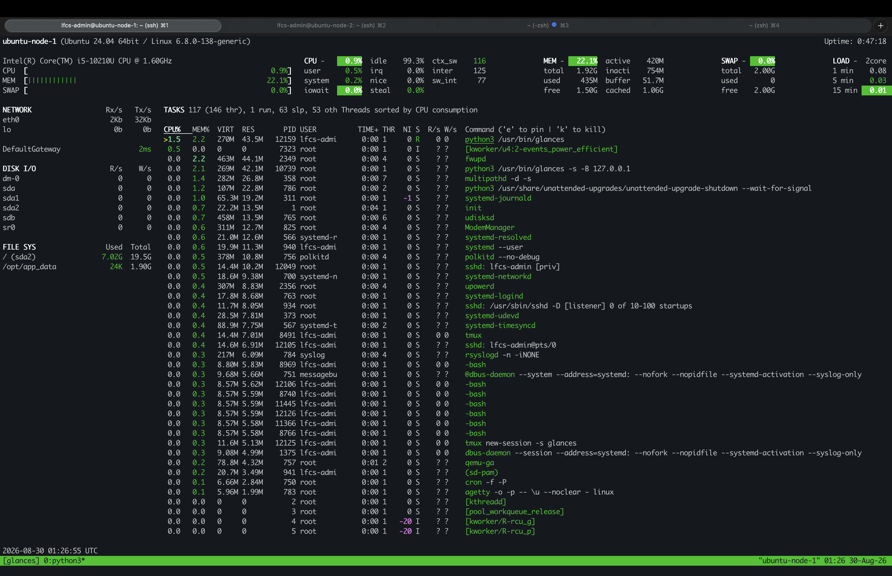
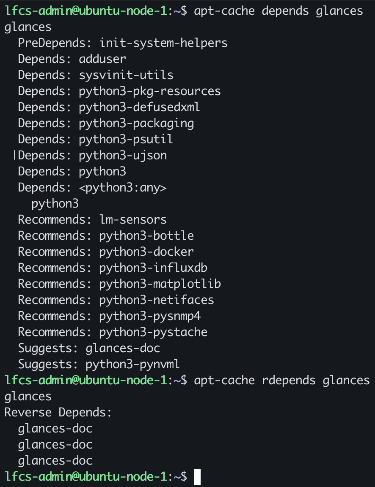

# Install, Verify, and Inspect Package Contents

## Package Inspection (before installation)

`command -v glances`, is the current shell able to resolve the command? No, the shell cannot resolve `glances`, command lookup fails.

`dpkg -s glances`, does the Debian Package manager recognise it as installed on the system? No, the package is not installed, and dpkg has no information available

`apt-cache policy glances`, is the package installed? If so which Version? Are there any candidates? Which repository is it present in?

`glances` is not installed, the candidate is ` 3.4.0.3+dfsg-1`, the version is `3.4.0.3+dfsg-1` with apt priority 500. From the `noble/universe` repository 

## If I install the package, what will happen(prediction)?

`glances`state should change installed, both `dpkg` nd `apt-cache policy` should report this change.

The filesystem should include a pathname that is owned by the installed package, in this case `glances`. `glances` might form dependencies on other packages, and other packages might form dependencies on `glances`.

An install is successful once `command`, is able to resolve, `dpkg` confirms the system recognise the installed package, `apt-cache policy`'s output confirms the installation, the version, the candidate and from which repository.

## Package installation & State

`sudo apt install glances`, outputs the additional packages needed for `glances` to work. `100 newly installed` means it will install 100 packages.

## Packages state verification (after installation)

`command -v glances`, is the current shell able to resolve the command? Yes, the shell can resolve `glances`, command lookup is successful.

`dpkg -s glances`, does the Debian Package manager recognise it as installed on the system? Yes, the package status is: `install ok installed`, and dpkg is able to provide metadata information such as: dependencies, version, description.

`apt-cache policy glances`, is the package installed? If so which Version? Are there any candidates? Which repository is it present in?

yes, the version installed is `3.4.0.3+dfsg-1`, the candidate is ` 3.4.0.3+dfsg-1`. From the `noble/universe` repository 

`dpkg -L glances` lists the filesystems pathnames recorded for the installed package `glances`

## Does the installed package function?

I tested if the package installed would run as expected:
`glances --version `

`glances --help `

`glances`

## What dependencies did the package form?

`apt-cache depends glances` answers:
What packages does `glances` depend on? 

`apt-cache rdepends glances` answers:
what packages depend on `glances`?

