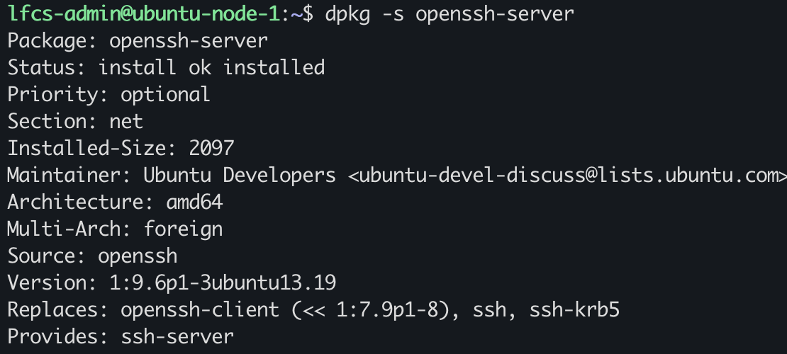
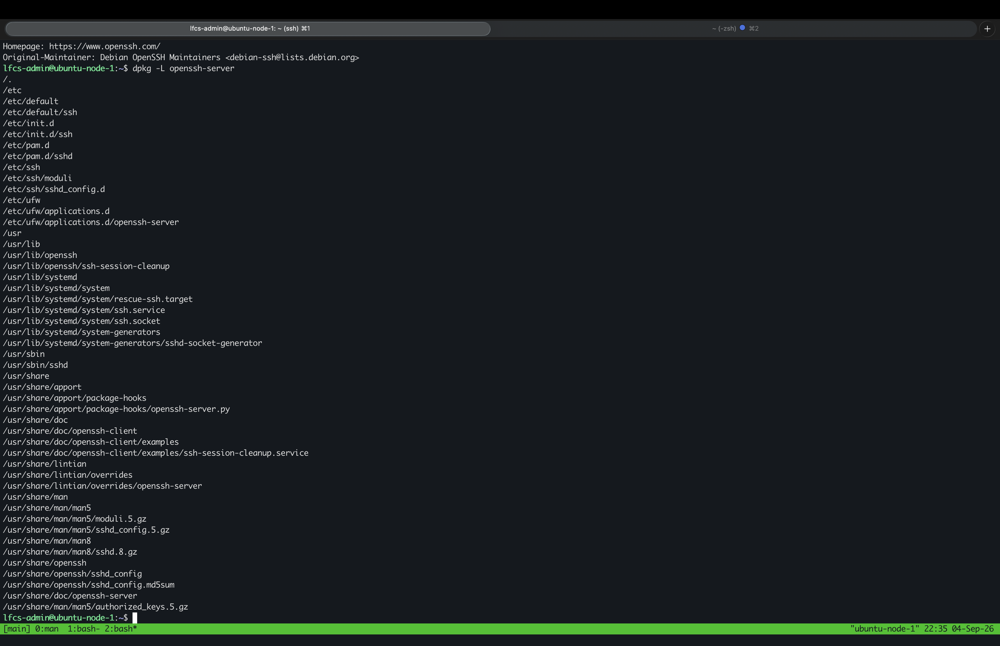
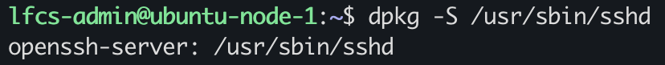
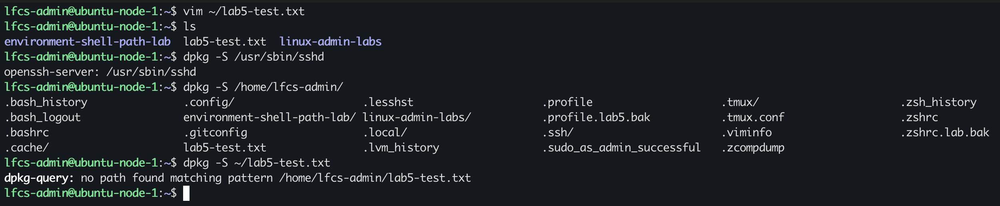
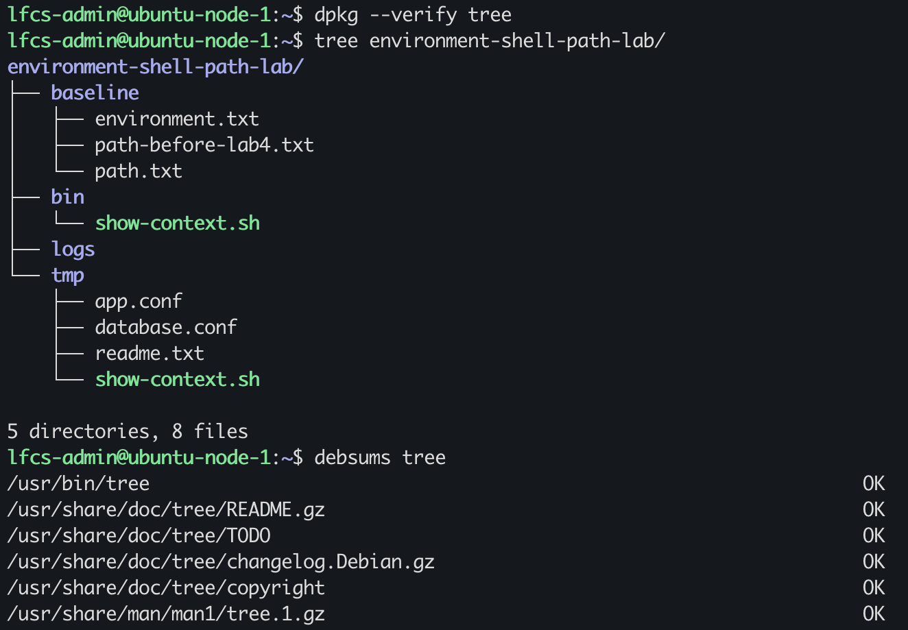
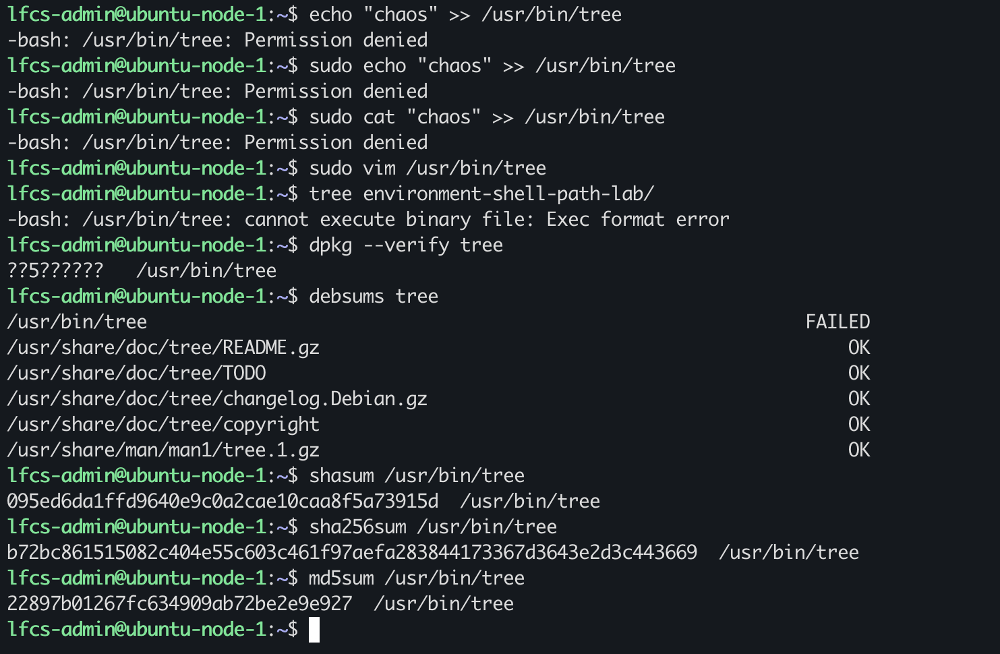
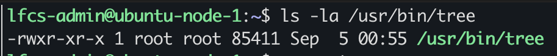
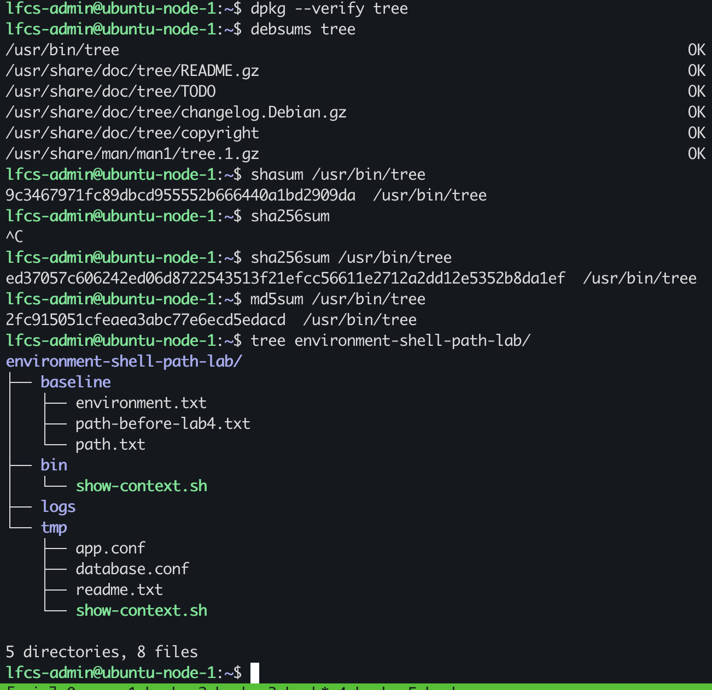

# Package Ownership, Files, and Integrity

## package state and ownership

dpkg's package database records pathnames supplied by packages, indicating package ownership

`/usr/sbin/sshd`, does not prove that openssh-server owns it.

`dpkg -S /usr/sbin/sshd` would establish that the package owns that file; dpkg registered `/usr/sbin/sshd` as belonging to `openssh-server`

## Observed ownership

`dpkg -s openssh-server` answers: does the system recognise this package as installed?

`dpkg -L openssh-server` answers: which filesystem pathnames are recorded for the installed package?

`dpkg -S /usr/sbin/sshd` answers: what registered package owns this file?

## Package-managed file vs arbitrary file

I created a dummy file using vim, to then ask the package database who owns the file. 

I ran `dpkg -S ~/lab5-test.txt` which resulted in `dpkg-query: no path found matching pattern`, as expected because I queried the package database for a file that is not managed by. a package

A file that exists on the filesystem is not the same a file marked as owned to an install package.

## Integrity lab 

I will be using `tree` for the integrity lab 
`tree` owns `/usr/bin/tree` 
confirmed by running `dpkg -L tree` 
`/usr/bin/tree` is an oridinary package payload

I will use `dpkg --verify` this carries out a md5sum verification of the file contents against the stored value in the files database

I will append a few character to `/usr/bin/tree` this should cause the checksum to change.

to restore `/usr/bin/tree`, I will use `apt reinstall tree`

### verification

### modification

`dpkg --verify tree` shows `??5??????   /usr/bin/tree`, dpkg checked the md5sum and determined that the current value does not match with what is stored in the database

I was able to use. `echo` or `cat` to append the file so I used `vim` to edit the `/usr/bin/tree` file.

#### permission shell

using `echo` with or without privilege did not work because my user's unprivileged shell. The shell attempt to open the file before writing into it. the file belongs to root and is rwx privileges. other only have r-x with no write permissions.

#### incorrect usage of cat

using `cat` to append was the wrong choice because the arguments within quotes are used as a path to a file.

### restoration

confirmed what other packages this transaction would pull in with `sudo apt reinstall -s tree` before installation the proceed with `sudo apt reinstall tree`

