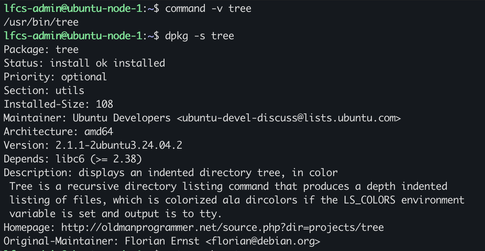
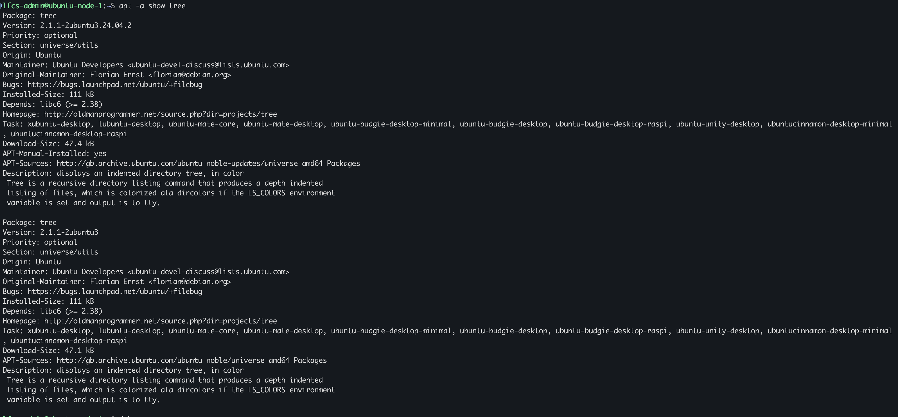
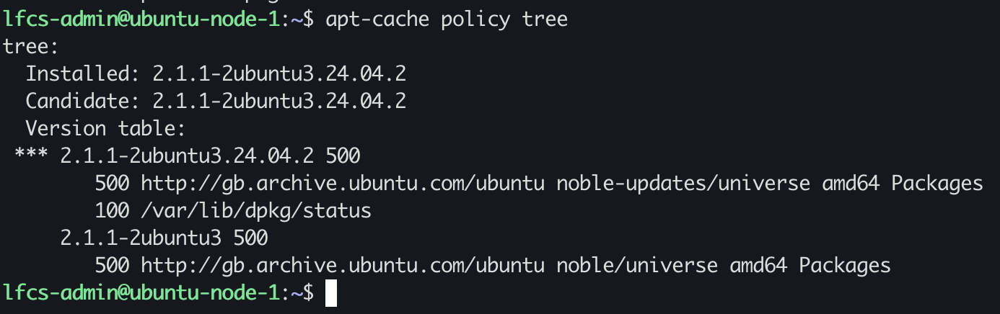
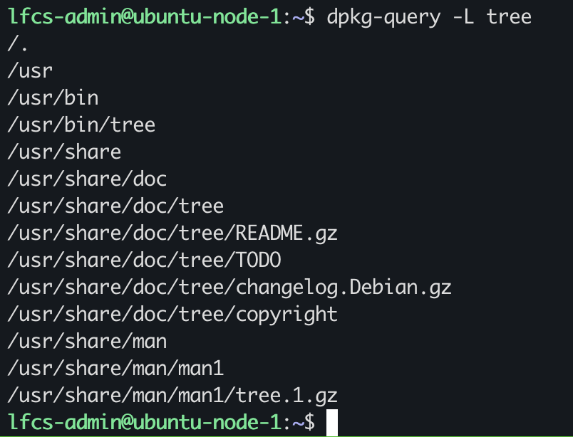
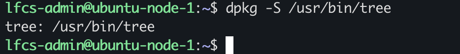
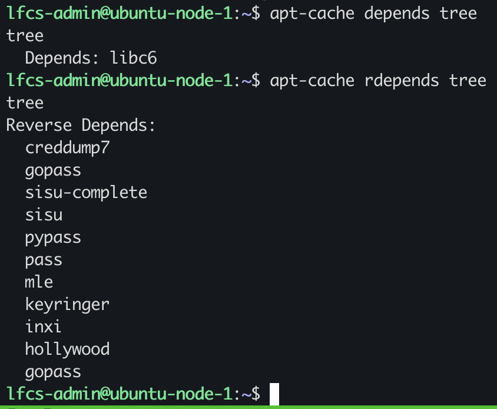

# Package Management: APT, dpkg and Package State

## Package State and Repository Awareness.

Shell resolution:` command -v tree` tells me wether or not the shell is able to resolve the command

`dpkg -s tree` installed state: `install ok installed`, dpkg recognises tree as an installed package
exit status 0 `requested action was successfully performed`

`dpkg -s ` and `command -v` together, tell you that the shell can resolve the command and that the actual package is installed. These findings indicate that the Debian package database accounts `tree` as installed.Just because a command can't resolve it does not mean it's not installed

APT installed/candidate state: `apt -a show tree` returns two outputs from the same package `tree` but different versions:

`-a` options shows all versions

`2.1.1-2ubuntu3.24.04.2`
`2.1.1-2ubuntu3`

Repository/version evidence: `apt-cache policy tree` answers: what package is installed, what is the candidate, from which repository and what version

### investigate the existing installation of a package

I will be using `tree` as an example:

`dpkg-query -L tree` lists the filesystems pathnames recorded for the installed package `tree`

`dpkg -S /usr/bin/tree` answers:
which installed package owns `/usr/bin/tree`? 

if `dpkg` finds no owner either the package has not been directly installed by a Debian package or the queried pathname is different from the path registered by the package.

shows which installed package owns the pathname

`apt-cache depends tree` answers:
What packages does `tree` depend on? 

`apt-cache rdepends tree` answers:
what packages depend on `tree`?

