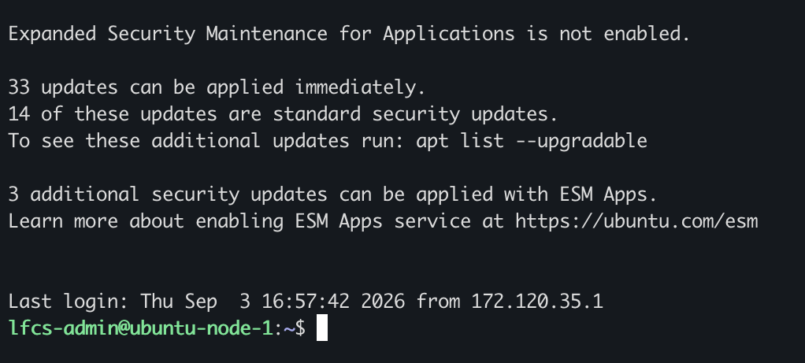
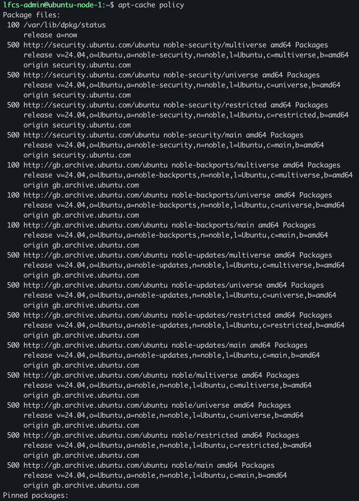
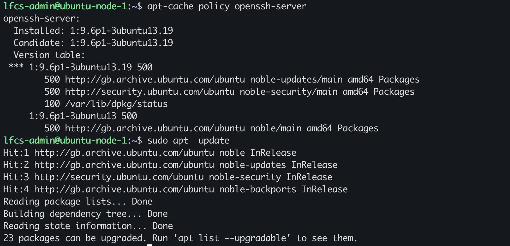

# Repository Metadata, apt update, and Upgrade Decisions

## VM current state

Does my VM know about new version of packages in the Ubuntu repositories?

Whenever I ssh into my VM it notifies me 33 outstanding updates.

`apt-cache policy` shows which repositories the VM pulls updates from.

I installed `openssh-server`, installed version is: 1:9.6p1-3ubuntu13.19  with candidate: 1:9.6p1-3ubuntu13.19

`apt update` downloads the repository/package index metadata without upgrading the installed packages, only the local APT metadata is changed.
There are 23 packages currently upgradeable packages. So out of the 23 packages only 33 can be upgraded meaning:

a new version is available or package index metadata has been updated, when there's updates, `hit` will show.

`apt-cache policy openssh-server` result could have been stale, if `apt update` was not run prior, this can indicate that he local APT metadata was not refreshed

`apt list --upgradeable` shows packages that can be upgraded to the candidate version.

