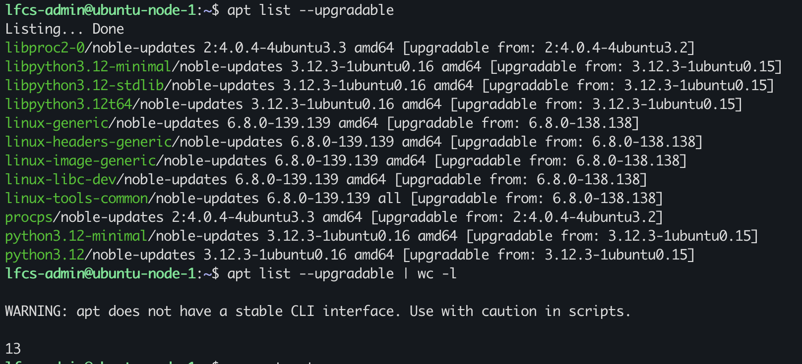
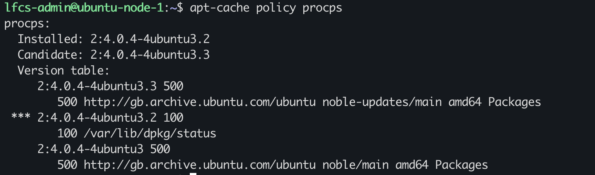
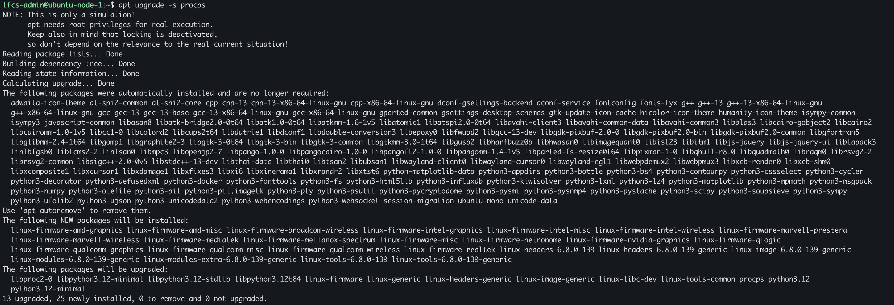
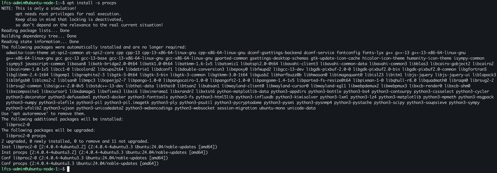

# Repository Metadata, apt update, and Upgrade Decisions

## VM current state

Does my VM know about new version of packages in the Ubuntu repositories?

Whenever I ssh into my VM it notifies me 33 outstanding updates.

`apt-cache policy` shows which repositories the VM pulls updates from.

I installed `openssh-server`, installed version is: 1:9.6p1-3ubuntu13.19  with candidate: 1:9.6p1-3ubuntu13.19

## Update metadata

`apt update` downloads the repository/package index metadata without upgrading the installed packages, only the local APT metadata is changed.
There are 23 packages currently upgradeable packages. So out of the 33 packages only 23 can be upgraded meaning:

a new version is available or package index metadata has been updated, when there's updates, `hit` will show.

`apt-cache policy openssh-server` result could have been stale, if `apt update` was not run prior, this can indicate that he local APT metadata was not refreshed

`apt list --upgradeable` shows packages that can be upgraded to the candidate version. On here it shows `13`, I had upgraded the packages in a previous session and started a new session hence the number of package upgrades is different.

## Upgrade simulation 

I ran `apt-cache policy procps` to determine the current/candidate version and source repository:

### prediction
If I upgrade `procps`, APT will recursively check and upgrade the packages that `procps` depends on. So during the upgrade transaction other packages might be upgraded.

### apt upgrade -s

`apt upgrade -s procps`, APT proposed 13 upgrades, 25 new installs. The changes on the system are far broader than intended.

## upgrade vs install

`apt upgrade` is used to install the newest versions of all packages currently installed on the system.

on the other hand

`apt install` is used to install packages or upgrade packages if the package is already installed.

so a safer command to reduce the blast-radius would be `apt install -s procps`, minimizes the upgrade scope while APT still resolving any dependencies required for that upgrade.

`apt install -s procps` shows a much smaller installation compared to `apt upgrade -s procps`: `2 upgrades`

## Mental Model

The repository state on a system factors in the following:

- Local APT metadata, is refreshed when running `apt update`. APT use local cached package indexes to make decisions. An update should always be done before an upgrade so that APT can track the available/candidate versions.

- Candidate version, the candidate versions is the latest version APT knows about locally, hence update should be carried out to get the latest candidate version.

`apt-cache policy <pkg>`

- simulated transaction, allows you to inspect what changes would occur if the transactions happened, allowing you to assess, make judgement and inform from evidence.

`apt install -s <pkg>` or `apt upgrade -s`, depending on your intended scope.

installed dpkg state, this is what the system considers as installed by the package manager. 

`dpkg -s <pkg>` could show either `Status: install ok installed` or `Status: deinstall ok config-files`

