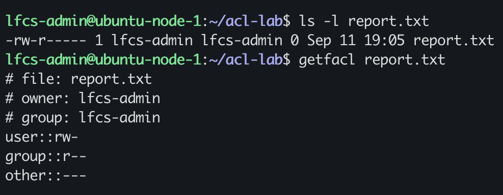
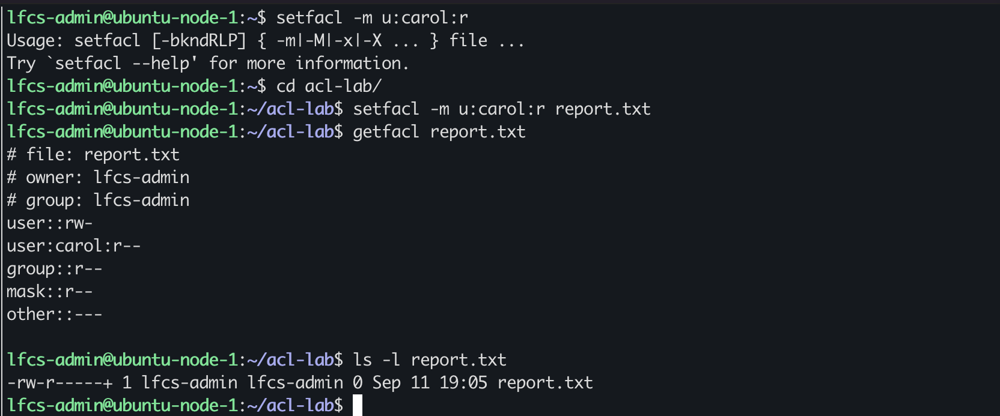
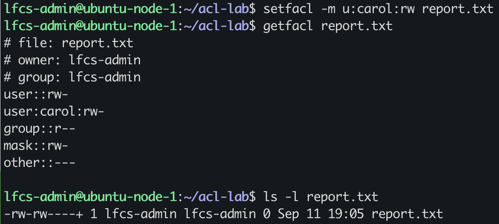
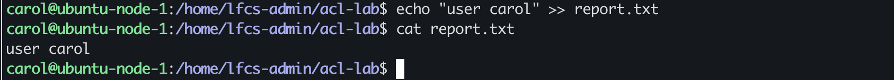
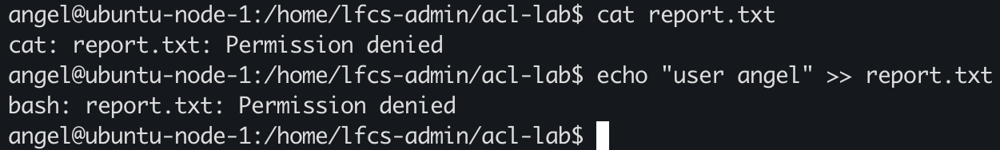

# Access ACL fundamentals

ACL's extend the traditional owner/group/other permissions model with additional entries

ACL mask: sets maximum(limits) permission that can be granted on a entry specifically user, group objects and groups. except others and file owner

default ACL: initial access ACL for objects created within that directory

a trailing `+` in `ls -l` means a file or directory has an Access Control List (ACL) with extra permissions beyond the standard owner, group, and others traditional model.

once an extended ACL is implemented, the middled three mode bits correspond to the ACL mask, representing the maximum permission of the group class.

For example:

user::rwx
user:carol:rwx
group::rwx
mask::r--
other::---

the concept can can be represented as:

rwxr------
   ^^^
   mask

a file has thr following traditional mode:

755
user::rwx
group::r-x
other::r-x

the acl mask is: 

mask::rw-

The effective permission would be. r--

The mask does not add permissions, it sets the limit only.

ACL rule to carry forward: `Effective permission = matching group-class ACL permissions - mask`

## named user + mask

created the following lab object:

/tmp/acl-lab/
└── report.txt

the target initial state for `report.txt` is:

owner: `lfcs-admin`
group: `lfcs-admin`
mode: 640

the file `report.txt` is owned by `lfcs-admin`, the owning group is `lfcs-admin`

the traditional permissions are:   `-rw-r------` or `640`

the owner has read+write rights the group only has read rights others have no rights

there are no extended ACL 

### prediction acl

`setfacl -m u:carol:r report.txt` is the command I will use to set the ACL

`getfacl report.txt` should show:

user::rw-
user:carol:r--
group::r--
mask::r--
other::--

### acl manipulation

#### prediction

`getfacl report.txt` shows:

user::rw-
user:carol:r--
group::r--
mask::r--
other::--

I then proceeded to change carol's ACL entry to `rw-`:

my `getfacl report.txt` prediction was:

`mask::rw-`

`ls -l` will shows `r--` on the group

#### observed behaviour

`getfacl report.txt` showed:

file: report.txt
owner: lfcs-admin
group: lfcs-admin
user::rw-
user:carol:rw-
group::r--
mask::rw-
other::---

`ls -l report.txt` showed:

`-rw-rw----+`

so my `ls -l` prediction was wrong, once an ACL is implemented the middle triplet shows by `ls -l` will reflect the mask.

### acl interpretation 

`getfacl report.txt` shows that the group only has `r--` , `ls -l report.txt` shows group has `rw-` when a ACL is implemented the middle triplets shows by `ls -l `will reflect the mask, however an ACL only sets the ceiling, effectively group only has `r--`

### testing acl

I will use:

`echo "user carol" >> report.txt`

`cat report.txt`

#### prediction:

Carol should be able to read and write the file report.txt

other user "angel":

`echo "user angel" >> report.txt`

`cat report.txt`

other user should not be able to read or write the file report.txt

#### bahviour

carol@ubuntu-node-1:/home/lfcs-admin/acl-lab$ echo "user carol" >> report.txt
carol@ubuntu-node-1:/home/lfcs-admin/acl-lab$ cat report.txt
user carol

angel@ubuntu-node-1:/home/lfcs-admin/acl-lab$ cat report.txt
cat: report.txt: Permission denied
angel@ubuntu-node-1:/home/lfcs-admin/acl-lab$ echo "user angel" >> report.txt
bash: report.txt: Permission denied

The result matches the ACL model

