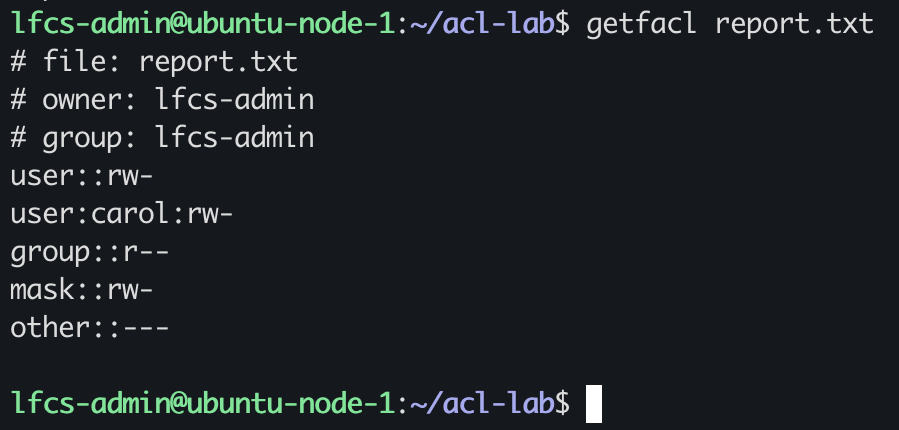
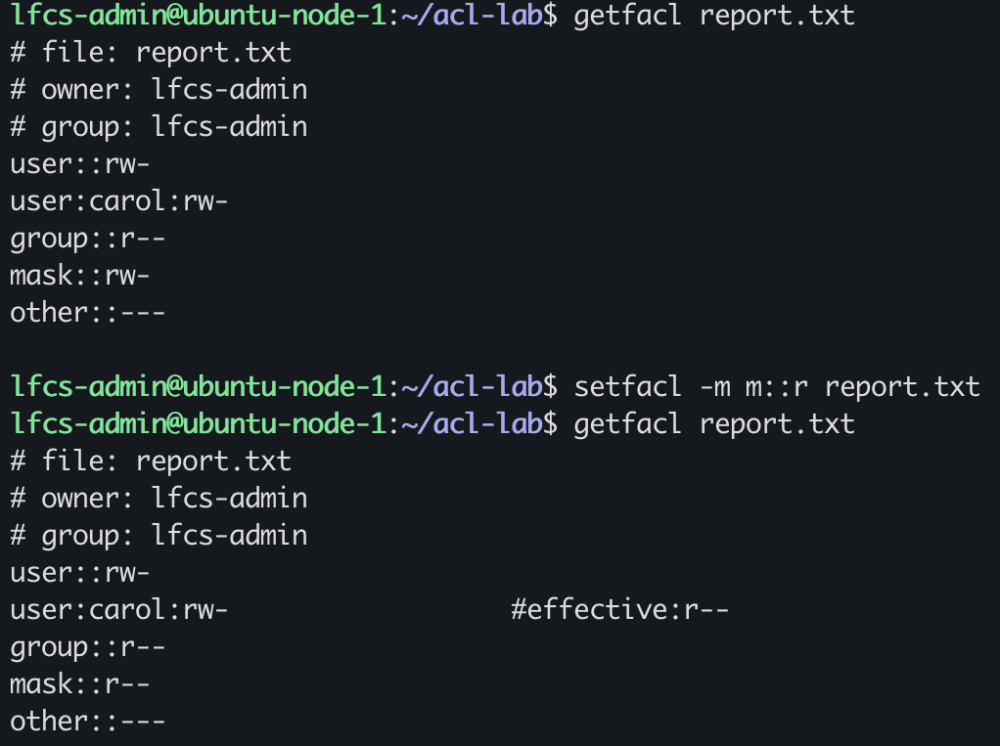
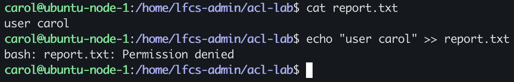
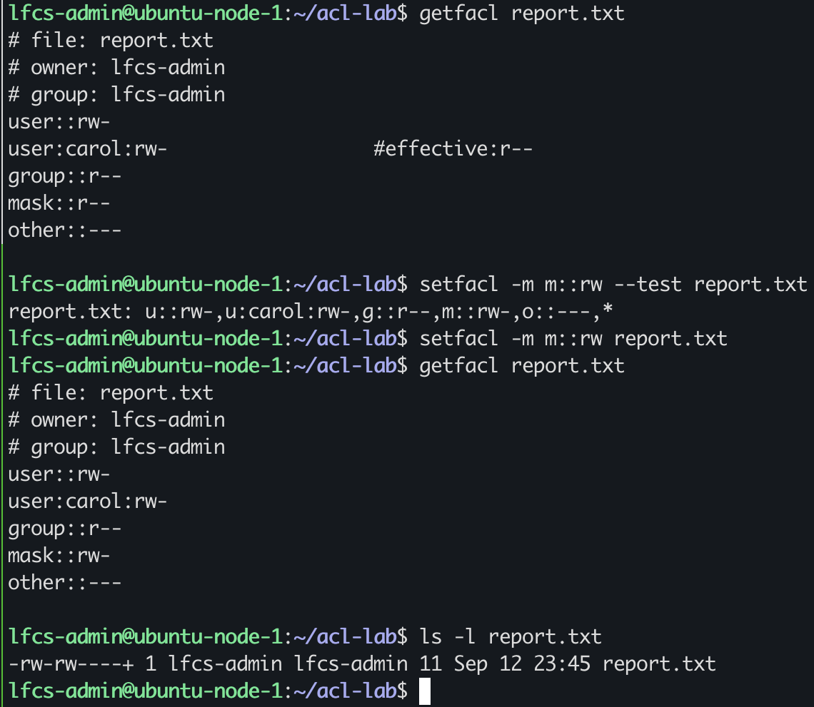
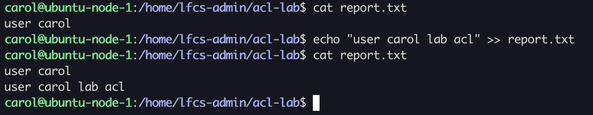
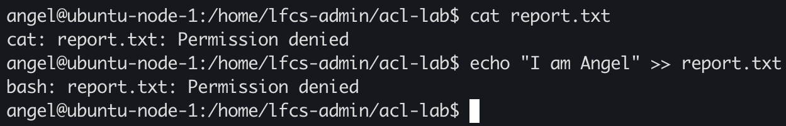

# ACL Mask Troubleshooting

## current & required state
current ACL state of report.txt:

user::rw-
user:carol:rw-
group::r--
mask::rw-
other::---

the required state is to have the mask `r--`

user::rw-
user:carol:rw-
group::r--
mask::r--
other::---

I used `setfacl -m m::r report.txt` to set the mask acl for `report.txt`

confirmed `report.txt` state using `getfacl report.txt`

user::rw-
user:carol:rw-                  #effective:r--
group::r--
mask::r--
other::---

## Troubleshooting

A colleague reported:

`Carol is supposed to have read/write access to report.txt. She can read it, but  when she attempts to modify it returns Permission denied`

### reproduce the symptom reported

`cat report.txt` prints `user carol` to stdout

`echo "user carol" >> report.txt` prints `bash: report.txt: Permission denied`

The reported symptoms match the behaviour investigated.

Carol has `rw-` permissions but the effective permission is `r--`, this is also shown in `getfacl report.txt` output

### hypothesis

The ACL mask limits Carol's the effective permission to `r--`, even though Carol has an entry of `rw-`.

### proposed fix 

The root cause stems from the ACL mask, it is limiting Carol's effective permissions to 'r--' only

The smallest justified change would be to change the ACL mask to `rw-`

Blast radius: modifying the ACL mask also limits the group's ACL entry. 

Verification of corrected state: Carol should be able to read from report.txt and write to it as well.

command to implement fix `setfacl -m m::rw report.txt`

## Recovery

`getfacl report.txt` to get the current state

`setfacl -m m::rw --test report.txt` to run a test and inspect blast radius and what changes would be modified if implemented, once confirmed the blast radius proceeded with `setfacl -m m::rw report.txt` 

confirmed with `getfacl report.txt` to confirmed the manipulated state

### functional state & intended behaviour

Can Carol read and write to the file?

to test this:

I ran `cat report.txt` to test if the user could open and read the contents:

user carol
user carol lab acl

and I ran `echo "user carol lab acl" >> report.txt` to test if she could open the file append and write contents

both tests added validation to the recovery plan, intended behaviour and functional state.

To test if Angel accidentally gained access, I test her read write access:

angel@ubuntu-node-1:/home/lfcs-admin/acl-lab$ cat report.txt
cat: report.txt: Permission denied
angel@ubuntu-node-1:/home/lfcs-admin/acl-lab$ echo "I am Angel" >> report.txt
bash: report.txt: Permission denied

This allowed to verify that the change did also expand to `other`. The mask was modified from `r--` to `rw-`, increasing the the permissions to the group ACL entries. Functional verification confirmed Carol regained the intended write access while Angel, who is classed as other; `other::---`, remained unable to read or write.

The Rollback would have been to set the acl mask's state to the previous state before I made change which would have also negated Carol access. 

