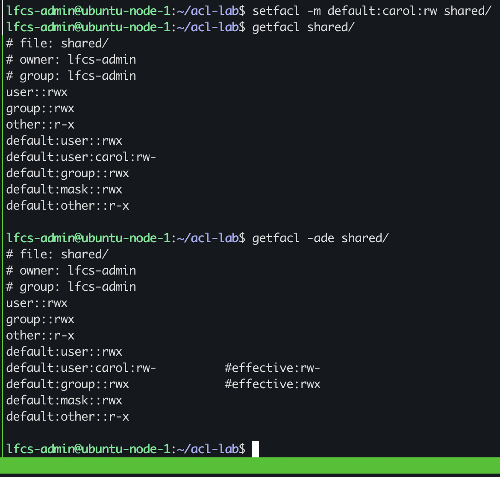
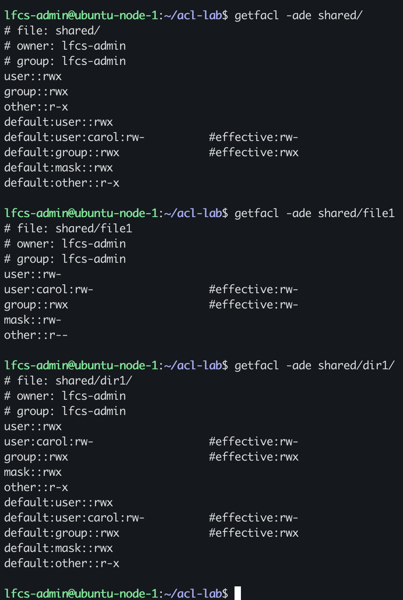
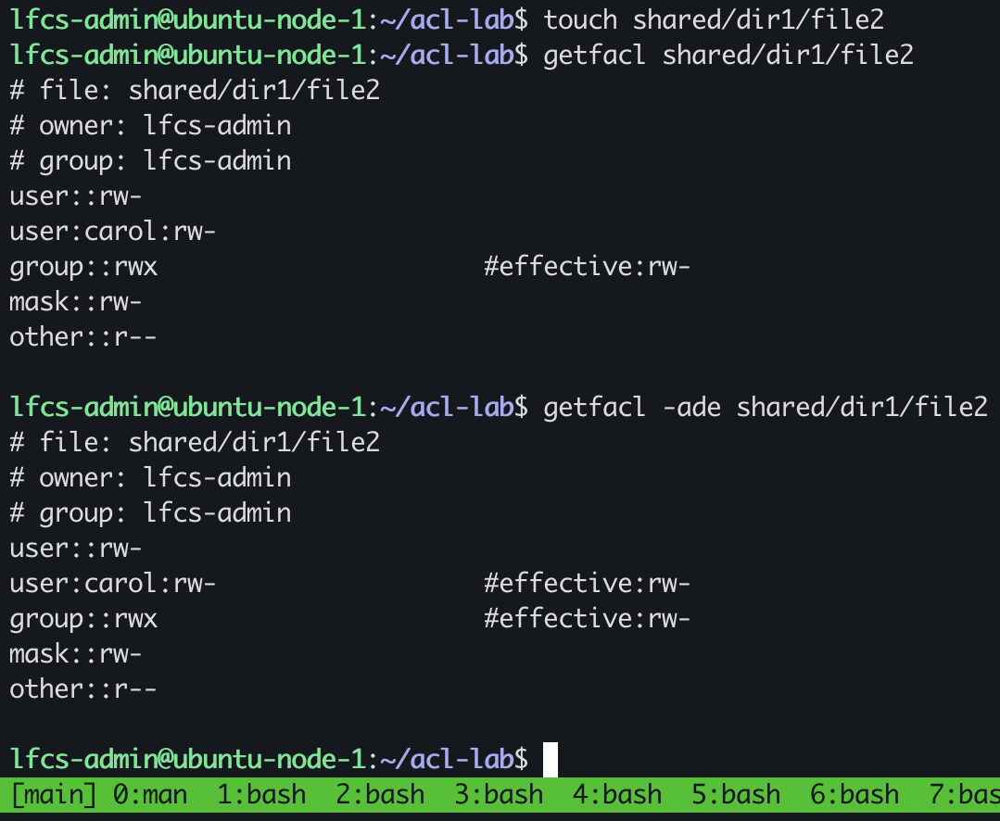

# Default ACLs and Inheritance

lab environment: 

`~/acl-lab/shared`

an access ACL on `shared/` would be insufficient to grant Carol a standard extended ACL entry because an ACL entry is not recursive, it only applies to the current object

a default access acl entry needs to present at the parent folder

a default ACL is associated with a directory, it is used to determine the ACL of a new object, the new object inherits the default ACL of the parent directory as its access ACL

If no default ACL is associated with a directory: the file creation mask(umask) is used to determine the ACL of the new object

A new created file and subdirectory will not inherit identical effective permissions depending on the base default traditional permission

## default access ACL

Baseline access ACL:

#file: shared/
#owner: lfcs-admin
#group: lfcs-admin
user::rwx
group::rwx
other::r-x

Proposed default ACL entry for Carol:  user:carol:rw-

Command I intend to use: `setfacl -m -default:carol:rw shared/`

Predicted `getfacl` output after the change:

default:user::rwx
default:user:carol:rw-
default:group::rwx
default:mask::rwx
default:other::r-x

### observed behaviour

the default access ACL is reconstructed using the traditional permission mode. Although the mask is `rwx` Carol's effective right are `rw-`

`getfacl shared/`

user::rwx
group::rwx
other::r-x
default:user::rwx
lfcs-admin@ubuntu-node-1:~$ cd acl-lab/                                                                    default:user:carol:rw-          #effective:rw-
lfcs-admin@ubuntu-node-1:~/acl-lab$ ls -l shared/                                                          default:group::rwx              #effective:rwx
default:mask::rwx
default:other::r-x

## inheritance 

### prediction

I will test how default access ACL's affect newly created files and directories

I predict the following:

new regular file:
user::rw-
user:carol:rw-
group::rw-
mask::rw-
other::rw-

new subdirectory:
user::rwx
user:carol:rw-
group::rwx
mask::rwx
other::r-x

### observed behaviour

I created `file1` and `dir1/` within the `shared/` directory

I ran `getfacl` on all three objects:

`getfacl shared/`:

lfcs-admin@ubuntu-node-1:~/acl-lab$ getfacl -ade shared/
file: shared/
owner: lfcs-admin
group: lfcs-admin
user::rwx
group::rwx
other::r-x
default:user::rwx
default:user:carol:rw-          #effective:rw-
default:group::rwx              #effective:rwx
default:mask::rwx
default:other::r-x

`getfacl shared/file1`:

lfcs-admin@ubuntu-node-1:~/acl-lab$ getfacl -ade shared/file1
file: shared/file1
owner: lfcs-admin
group: lfcs-admin
user::rw-
user:carol:rw-                  #effective:rw-
group::rwx                      #effective:rw-
mask::rw-
other::r--

`getfacl shared/dir1`:

lfcs-admin@ubuntu-node-1:~/acl-lab$ getfacl -ade shared/dir1/
file: shared/dir1/
owner: lfcs-admin
group: lfcs-admin
user::rwx
user:carol:rw-                  #effective:rw-
group::rwx                      #effective:rwx
mask::rwx
other::r-x
default:user::rwx
default:user:carol:rw-          #effective:rw-
default:group::rwx              #effective:rwx
default:mask::rwx
default:other::r-x

### explanation:

The parent default ACL is used to establish the inheritance blueprint, an entry at creation mode is constrained by the child ACL's of the parent directory

`shared/file1`

`file1` inherits the default access ACLs partially, at creation a file has 0666 - umask, a file is created with no execution rights

`shared/dir1`

dir1 inherits all access ACL's and the default access ACL's. This tells me that default ACL inheritance continues down the directory tree.

### inheritance tree test:

If I create another file in the the `shared/dir1/` directory, will it inherit `shared/` or `shared/dir1/ `ACL?

`getfacl -ade shared/dir1/file2` prediction : 

file: shared/dir1/file2
owner: lfcs-admin
group: lfcs-admin
user::rw-
user:carol:rw-                  #effective:rw-
group::rwx                      #effective:rw-
mask::rw-
other::r--

the default ACL is passed downstream to the subsequent directories, so child directories inherit the default ACL from the immediate parent directory's, files created within a directory inherit the ACL from the directory they were created in, the ACL is used as a template to construct their ACL.

#### observation

`getfacl -ade shared/dir1/file2`:

lfcs-admin@ubuntu-node-1:~/acl-lab$ getfacl -ade shared/dir1/file2
file: shared/dir1/file2
owner: lfcs-admin
group: lfcs-admin
user::rw-
user:carol:rw-                  #effective:rw-
group::rwx                      #effective:rw-
mask::rw-
other::r--

`file2` verified my prediction: downstream directories inherit the default ACL from the immediate parent directories
files created within a directory use the immediate parent directory's ACL as template construct their own ACL

### non-retroactivity

if `shared/dir1`'s default ACL for Carol's entry changes:

does file2 ACL entries also change, if I create a new file, what will its default ACL look like?

proposed change default:user:carol:r--

prediction:

`getfacl -ade shared/dir1/file2`:

remains the same

lfcs-admin@ubuntu-node-1:~/acl-lab$ getfacl -ade shared/dir1/file2
file: shared/dir1/file2
owner: lfcs-admin
group: lfcs-admin
user::rw-
user:carol:rw-                  #effective:rw-
group::rwx                      #effective:rw-
mask::rw-
other::r--

`getfacl -ade shared/dir1/file3`:

lfcs-admin@ubuntu-node-1:~/acl-lab$ getfacl -ade shared/dir1/file1
file: shared/dir1/file3
owner: lfcs-admin
group: lfcs-admin
user::rw-
user:carol:r--                  #effective:r--
group::rwx                      #effective:rw-
mask::rw-
other::r--

### observation
