# text processing & pipes lab

## Goal

understand how stdin, stdout and stderr are processed on the shell, understand stdout redirection (overwrites and appending)
understand filtering techniques using grep to match patterns
make use of the wc to count lines, words and bytes
sort lines
uniq to remove duplicates
cut to extract fields
awk to extract and process fields and sed for editing, transformation/substitution streams

## Lab 0: Test data setup

I used `cat` + here-doc to create controlled sample files for the lab
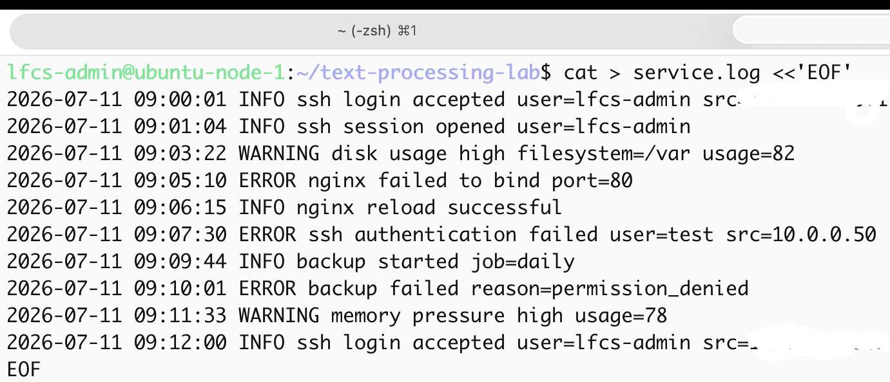

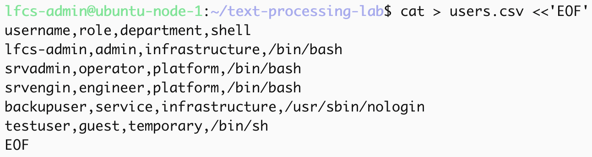

## Lab 1: Viewing and counting text

`cat service.log` concatenates files and prints to the standard output
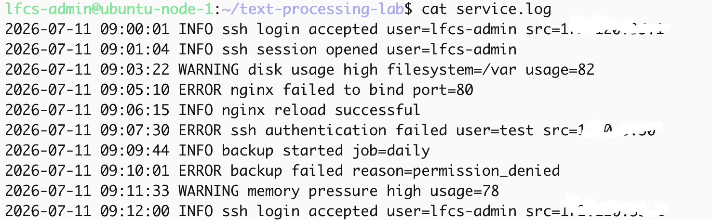

`head service.log` outputs the first 10 lines of a file
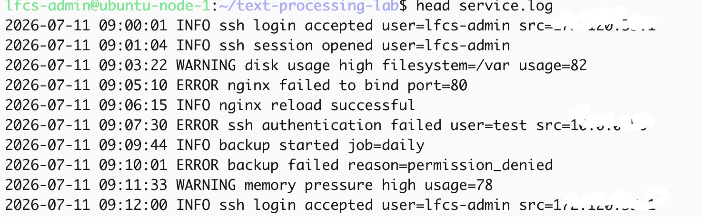

`tail service.log` outputs the last 10 lines of a file
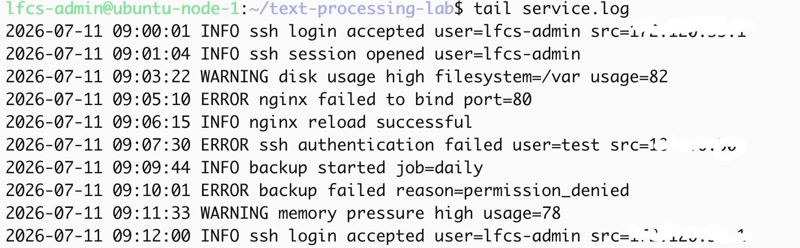

`wc service.log` shows lines count, words count , and bytes count for each file
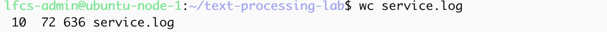

`wc -l service.log` shows lines count
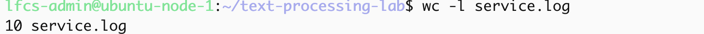

Becasue the file has 10 lines, `head` and `tail` displayed the whole document. By default `head` shows the first 10 lines, `tail` shows the last 10 lines.

### Mistake/observation

I made a quoting mistake while creating the here-doc, so the shell kept waiting for inputs. I exited the unfinished command with `ctrl+c`, which sends SIGINT.

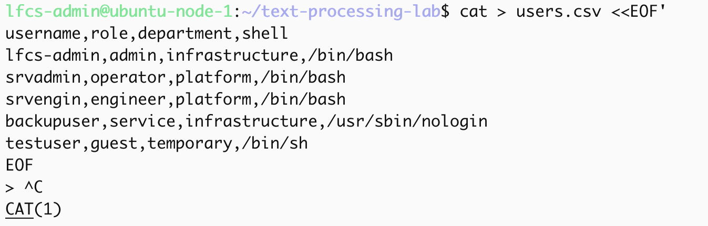

## Lab 2: grep filtering

`grep`  prints lines that match a pattern

the command `grep "ERROR" service.log`
tells grep to look for "ERROR" in the log file, if a line contain the pattern of "ERROR" it is sent to stdout
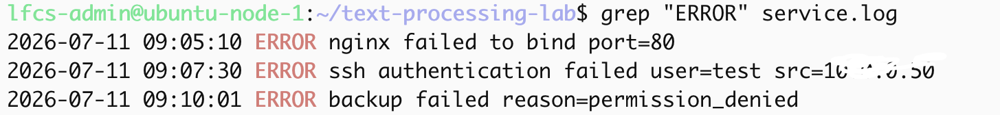

the command `grep "WARNING" service.log` tells grep to look for "WARNING" in the log file, if a line contain the pattern of "WARNING" it is sent to stdout
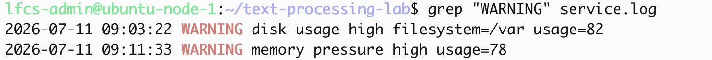

the command `grep "ssh" service.log` looks for "ssh" in the log file, if a line contain the pattern of "ssh" it is sent to stdout
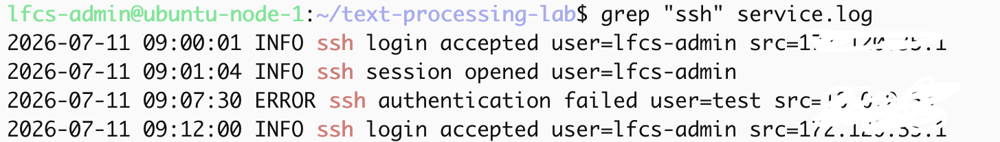

`grep -i "error" service.log` ignores case sensitivity in patterns and input data, lines will be sent to stdout as long as the characters match the pattern. the `-i` flag ignores case-sensitivity in patterns and input data.

the command `grep "error" service.log` looks for lines that contain the pattern. Since none of the lines contain `error`, nothing is printed to stdout
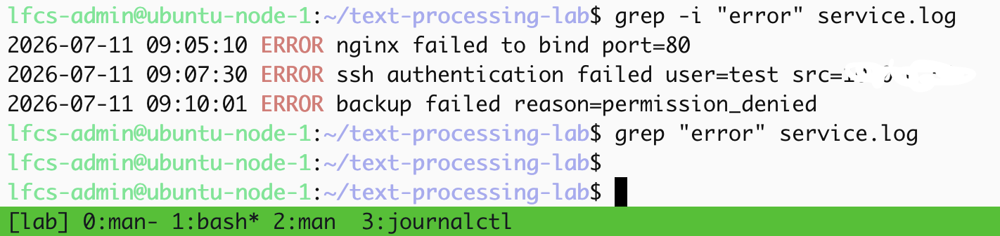

`grep -v "info" service.log` returned every line because the file contains `INFO` in uppercase, not `info` in lowercase. Without `-i` grep is case-sensitive. 

`-v` flag selects the lines that don't contain the matching pattern.
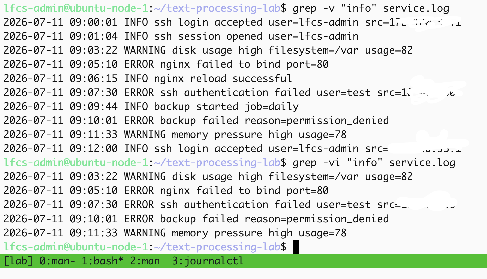

the command `grep -vi "info" service.log` looks for lines that do not match the pattern and ignores the case differences. 
1) `-v` would print all the lines, since none of the lines matche the pattern(inverst the match)
2) `-i` would ignore the case differences, so wether it's in capital or not it is excluded before sending to stdout, this works as a restrictive filter

`grep` can be  as filter to remove noise and restrict your searches, during troubleshooting you want specific patterns/logs.

applying broad patterns to your searches could result in more noise to get through which can lead to longer time troubleshooting. also a broad search mightt obfuscate the real issue if you are using the wrong logs to determine the problem.

#### Observation

I noticed that `grep` sometimes highlights the words when printed out.

## Lab 3: Pipes

The pipe symbol `|` sends stdout of a command on the left to stdin of the command on the right

`cat service.log | grep "ERROR"` sends contents from `service.log` into `grep`, then `grep` only prints the lines containing `ERROR`. 
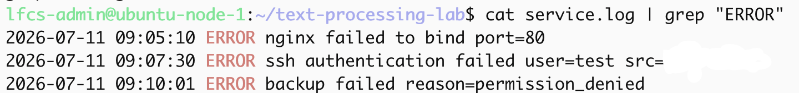

This works but it's usually unnecessary becase grep can read directly from a file:

`grep "ERROR" service.log`  
`grep "ERROR" service.log | wc -l` looks for lines  in `service.log` that contain `ERROR`,
the matching line are then sent into the `wc -l` command which counts the lines. The output was `3` meaning there were three matching error lines.

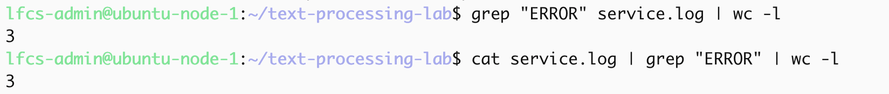

`grep "ssh" service.log | grep "accepted"`
acts as a double filter. it first filters for "ssh" related lines then narrows the output line that also contain "accepted", this results in the printing of lines that only contain both "ssh" and "accepted". 
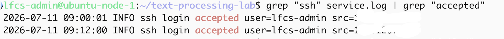

`grep "ssh" service.log | grep "failed"`

`grep "ssh" service.log | grep -v "failed"`
looks for "ssh" related lines, then removes lines containing `failed`.
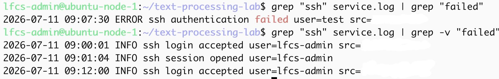

## Lab 4: sort and uniq

the `cut -d' ' -f3 service.log` uses a single space as the delimiter and extracts field 3 from each line.
in this log format field 3 is the severity level: `INFO`, `WARNING`, `ERROR`.
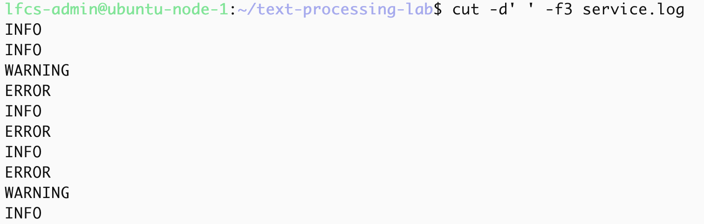

`cut -d' ' -f3 service.log | sort` 
`sort` is needed before `uniq` because it only compares adajacent lines. if duplicates are separated by other values `uniq` will not collapse them into one result.
using `sort` ensures the duplicates are adjacent. 
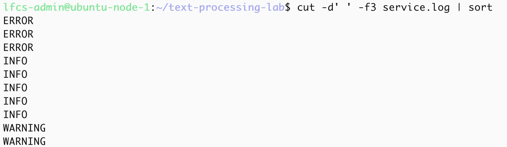

`cut -d' ' -f3 service.log | sort | uniq -c`
the `-c` argument adds prefix lines by the number of occurrences. For this lab it is usefull because it shows which log severity appeared most often, which is INFO with 5 apperances.
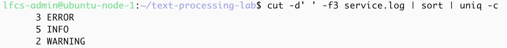

### Mistake or trap observed

When I ran `uniq -c` before `sort`, duplicate values that were not next to each other were counted individually.
This proves that  `uniq` does not search the whole file for duplicates. Only collpases adjacent duplicate lines.
The correct pipeline should be: extract > sort > count
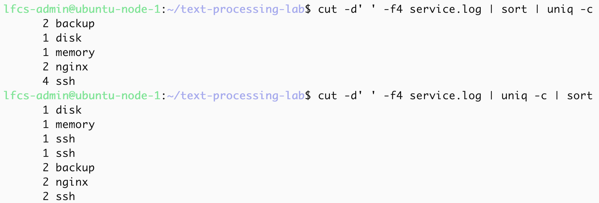

## Lab 5: cut field extraction

`cut` extracts selected fields or character ranges from each line and prints them to stdout. It does not modify the orginal file. 
The `users.csv` file use a comma as the delimiter. A delimiter is the character used to separate fields in each line.

`cut -d',' -f1 users.csv`
This uses ',' as the delimeter, and extracts field 1 which is the username field. 
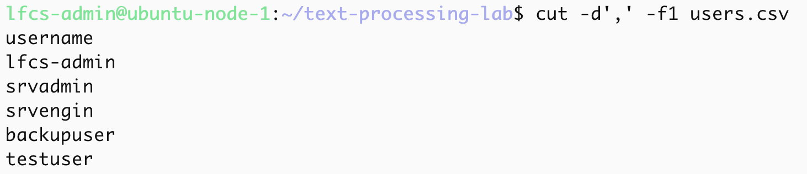

`cut -d',' -f2 users.csv`, extracts field 2 which is the role field. 
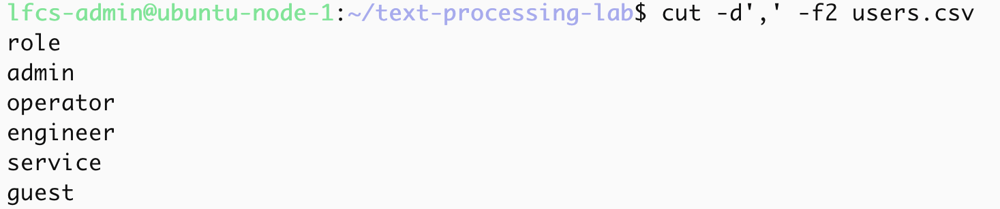

`cut -d',' -f1,4 users.csv`, extracts field 1 and 4 which are username and shell fields.
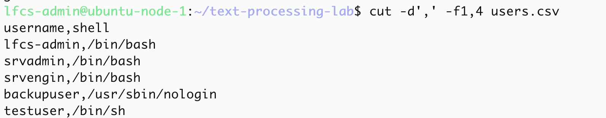

I then filtered the file first:

`grep "platform" users.csv | cut -d',' -f1,4`

`grep "platform"` returns the lines that only contain "platform", the matching lines are then passed into `cut` which extracts
thes username and shell fields. 

The platform users were:
- srvadmin 
- srvengin 
Both use `/bin/bash`
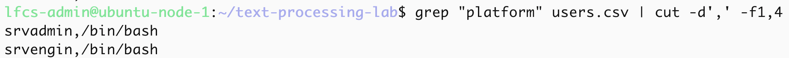

### `cut` Limitation

`cut` works well for simple prdictable delimeter-based files. if a file contains multiple chracters or complex formatting such as multiple consecutive delimiters, variable-width whitespace and embedded commas. `cut` is not a CSV parse and it may produce incorrect results.

## Lab 6: awk field extraction

`awk` is pattern-action processing language.

the basic structure is:
`pattern { action }`, if the pattern matches, `awk` performs the action. if no pattern is provided, the action runs for everyline.

By default awk separates fields by using whitespaces.

`awk '{print $3}' service.log`
I used `awk` to read from the `service.log` file and print the 3rd field of each line in the file, this format filed 3 is the severity level: 
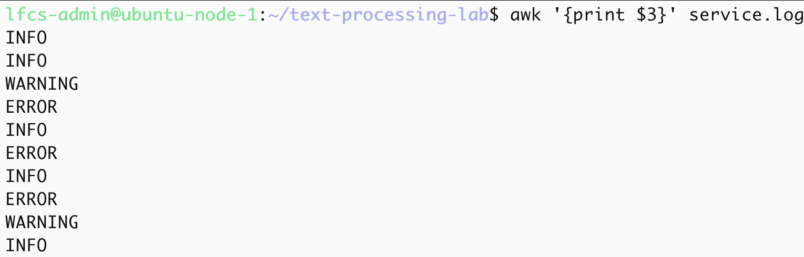

`awk '/ERROR/ {print $1, $2, $3, $4}' service.log`
`awk` this seaches for lines that contain "ERROR", and print the fields 1 trough to 4 for each matching line. 
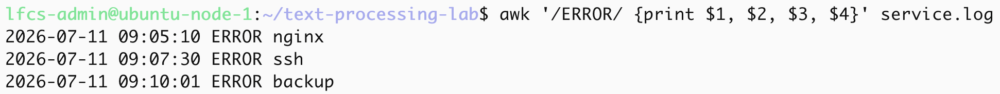

`awk -F',' '{print $1, $4}' users.csv`
`-F` sets the input field separator to a comma. This allows `awk` to process the comma separated file.
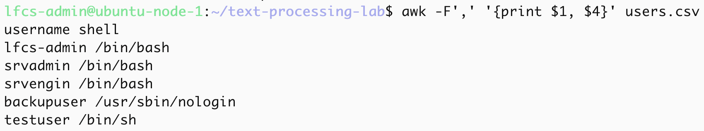

`awk -F',' '$3=="platform" {print $1, $4}' users.csv`
`$3==platform`, tests wether the 3rd field = `platform`, if true, `awk` runs the action block `{print $1, $4}` to print fields 1 and 4.

The matching users are:
- `srvadmin /bin/bash`
- `srvengin /bin/bash`
 
`awk` can filter by matching field values not just text patterns.
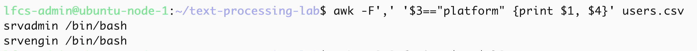
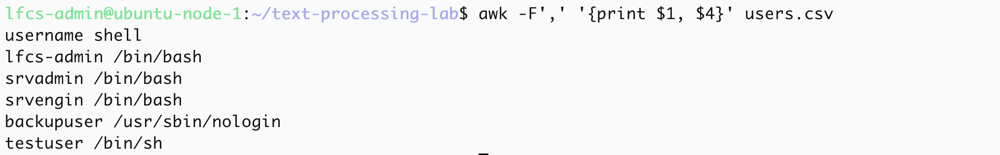

## Lab 7: sed transformations

`sed` is stream editor for filtering and transforming text
`sed` reads input linen by line, appllies editing rules, and prints the result to stdout by deafult. It does not modify the original file unless `-i` is used or output is tediecteed to another file.

### Substitution 

`sed 's/ERROR/CRITICAL/g' service.log` 

This a susbstitute command:
`s` means susbstitute
`ERROR` is the serach pattern 
`CRITICAL` is the replacement text
`g` replaces every match on the line

The command replaced `ERROR` with `CRITICAL` in the output, the original file `service.log` was not modified.
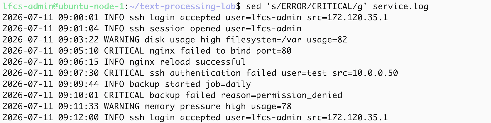

### Extracting usernames

`sed -n 's/.*user=\([^ ]*\).*/\1/p' service.log`

By default `sed` prints every line; The `-n`suppresses default printing. The substitution pattern captures the value after `user=` and print only the username.

`/p` only prints lines where substitution succeded.

 This extracted the usernames from log lines that contained a `user=` field.

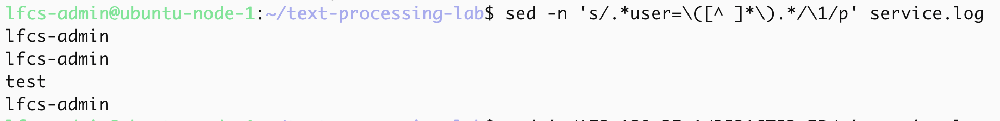

### Redacting sensitive data

`sed 's/172\.120\.35\.1/REDACTED_IP/g' service.log`, this relpaces the IP addess with `REDACTED_IP`

The dots are escaped so that it matches only a literal period character.

This proves `sed` can be used to sanitise logs before publishing screenshots or README examples

Sensitive data that should be redacted before publishing includes:
- IP addresses
- hostnames
- usernames where required
- tokens
- keys
- fingerprints
- internal paths or customer identifiers
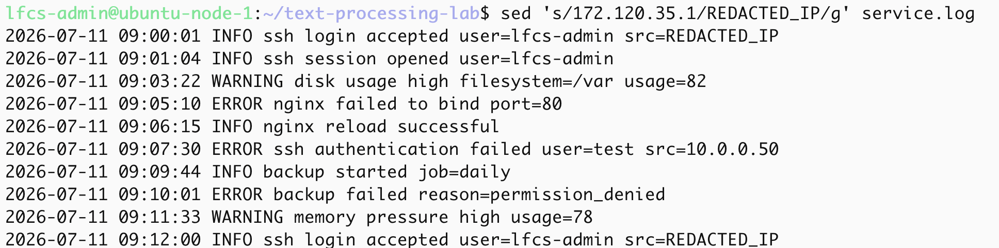

## Lab 8: Redirection

### stdout

`stdout`is the standard output strean. By default, stdout is displayed in the termimal, but it can redirected to a file.

`grep "ERROR" service.log > errors.log`, 
This searches `service.log` for lines containing "ERROR", if there are matches these are written to 'errors.log'.

The `>` operator redirects stdout and overwrites the target file if it exists, if does not exist it is created.

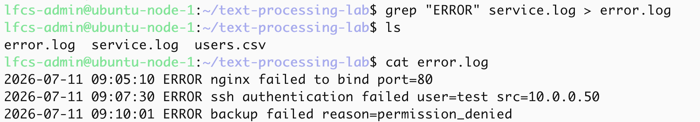

`grep "WARNING" service.log >> errors.log`
this searches `service.log` for lines containing "WARNING", if there are matches these are appended to `errors.log`.

The `>>` operator redirects stdout and appends the target file instead of overwriting it, similar to `>`, if the file doesnot exist it is created.

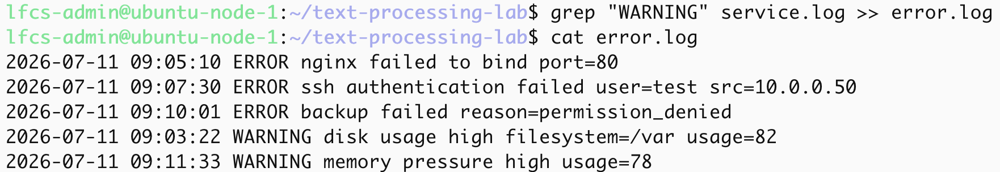

### stderr

`stderr` is the standard error stream. Progrms use sterr for error and iagnostic messages.

`ls /not/a/real/path > stdout.log`
This redirects stdout to `stdout.log` but the path does not exist. The error message still appeard to the terminal because it was written to `stderr` not `stdout`.

`stdout.log` was empty because the command produced a `stderr` output.

`ls /not/a/real/path 2> stderr.log`

Redirected stderr to `stderr.log`, the error message was written into `stderr.log`

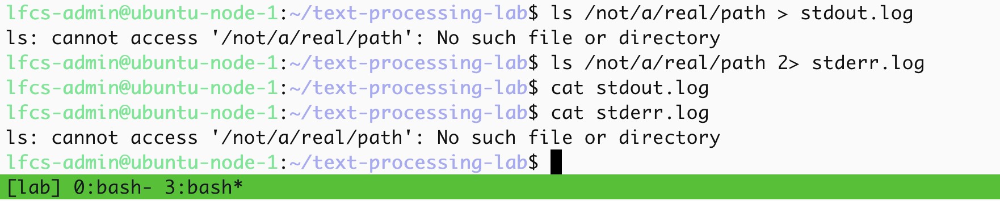

### Summary

- `>` redirects stdout and overwrites
- `>>` redirects stdout and appends
- `2>` redirects stderr and overwrites
- stdout is normal command output
- stderr is error/diagnostic output
- stdout and stderr can be redirected independently

## Lab 9: journalctl pipeline

For this lab I queried SSH service logs and built a pipeline to filter, redact, count and extracted useful fields.

### Filter accepted SSH authentication events and redact sensitive data

`journalctl -u ssh.service -n 50 --no-pager | grep -i "accepted" | sed -E 's/from ([0-9]{1,3}\.){3}[0-9]{1,3}/from REDACTED_IP/g' | sed 's/SHA256:[^ ]*/SHA256:REDACTED_KEY/g'`.

This searched for the last 50 SSH journal entries for lines containing `accepted`. The ssh matching events showed SSH public key authentication being accepted.

I used `sed` to redact sensitive values before pulishing the output. 

The redacted values include:
- Source IP address
- SSH public key fingerprint

This matters because logs can expose internal IP's, usernames, hostnames and authentication fingerprints.

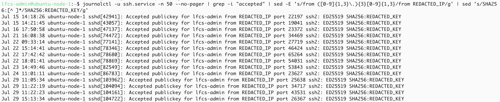

### Count matching events

`journalctl -u ssh.service -n 50 --no-pager | grep -i "accepted" | wc -l` 

This counted how many matching `accepted` log lines appeared in the last 50 SSH journal entries, the output was `14`.
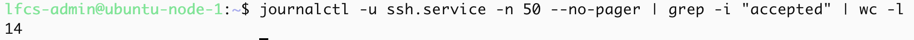

`journalctl -u ssh.service -n 50 --no-pager | grep -i "session opened" | wc -l` the output was `14`. This counted matching `sessions opened` in the same query scope.
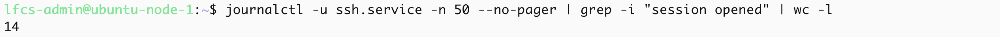

The counts are usefull because during investigation the can help estimate event frequency and spot unexpectd changes. However they only count matching line not unique or active sessions.

### Extract timestamp and process fields

`journalctl -u ssh.service -n 50 --no-pager | grep -i "accepted" | awk '{print $1, $2, $3, $5}'`

This extracted:

- month
- day
- time
- PID field

This produced a neat view of the when accepted SSH events occured and which `sshd` process logged them.
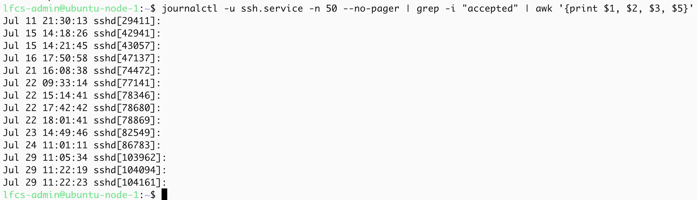

### Pattern risk
When using `grep`, if the pattern is too narrow, you risk excluding logs that are relevant to the event you are investigating, if the pattern is too broad, it may include unrelated events and inflate the findings.

For example, `accepted` is broader than `Accepted publickey`.

 
## Lab 10: pipeline traps and reporting

### Part A grep process trap

`sleep 600 &` starts a long process running in the background 
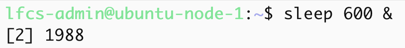

`ps` displays information of active processes.  
`ps aux | grep sleep` 
`ps aux` displays information of active processes, its stdout is piped into `grep sleep` which prints lines that contain the pattern `sleep`. I expected only the `sleep` process to show, however there was another entry from `grep`; `grep` is also a process, if the search pattern appears in the grep command line, grep can match itself. This proves that pipelines can  also produce  misleading results.
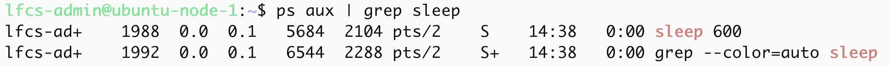

`ps aux | grep sleep | grep -v grep` 
`-v` is invert-match, it selects non-matching lines to send to stdout. In this case only the lines that do not contain `grep` were printed.
This can remove legitimate process lines if their command line contains the word `grep`.
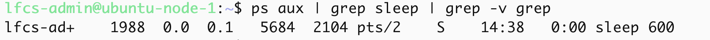

`ps aux | grep '[s]leep'` matches the line containing `sleep`, because `[s]` matches the character `s`. 
However, the grep command contains the pattern `[s]leep`, not the literal string `sleep`, so grep does not match its own process line.

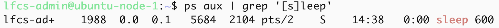

`pgrep -a sleep`
`pgrep` matches the process name. `-a` flag lists PID and full command line.

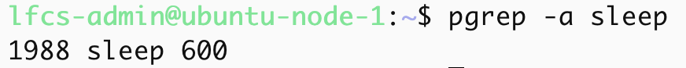

`ps` can still be usefull as it also shows the command, user, stat and pid. During an investigating, cross-checking evidence with multiple tools reduces the risk of drawing conclusions from a misleadng pipeline.

### Part B awk counts and reporting

`awk '{count[$3]++} END {for (level in count) print count[level], level}' service.log`, counts how many times each severity level appears in the 3rd column and prints the list.
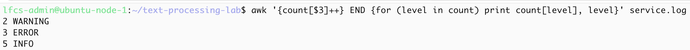

`awk '{count[$4]++} END {for (service in count) print count[service], service}' service.log`, similarly to the above however it counts how many times each service appears in the 4th column and prints the list.
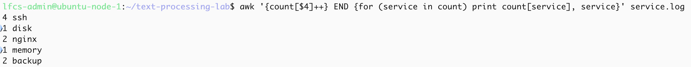

`awk '$3=="ERROR" {print $1, $2, $4, $5, $6, $7}' service.log`, looks for the lines where the 3rd field is `ERROR`, then prints the date, time, service name, and part of the error message.
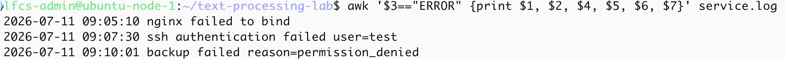

`awk '{count[$3]++} END {for (level in count) print count[level], level}' service.log | sort -nr`, parses the `service.log `file: it counts how many times each severity level appears in the 3rd column and prints the list sorted from highest occurrences to the lowest.
INFO appeared the most in the severity.
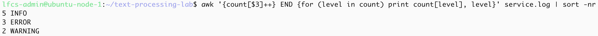

`awk '{count[$4]++} END {for (service in count) print count[service], service}' service.log | sort -nr`, parses the `service.log `file: it counts how many times each service appears in the 4th column and prints the list sorted from highest occurrences to the lowest. SSH has the most appearances.
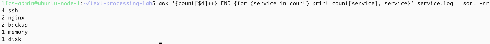

The order produce from `for (key in count)` is not guaranteed, a separate `sort` stage is required when ordered output is needed.

#### awk vs cut

`cut` is suitable for simple predictable field extraction when the delimiter and field positions are predictable.
`awk` is more appropriate here because it can perform field comparisons, mantainc counters, aggregate records, and generate reports. Neitheirt tool id universally better; the correct choice depends on the required processing.

Counts should be treated as evidence, not final conclusions. They depend on  the log source, time window, filters, and field assumptions in the pipeline.

## Final mental model

Linux commands usually communicate through streams.

- stdin is input
- stdout is normal output
- stderr is error or diagnostic output

Pipes connect stdout from one command to stdin of another command.

Redirection writes stdout or stderr into files.

Text-processing tools have different jobs:

- `cat` prints file contents
- `head` shows the beginning of a file
- `tail` shows the end of a file
- `wc` counts lines, words, and bytes
- `grep` filters lines by pattern
- `cut` extracts simple delimiter-based fields
- `sort` orders lines
- `uniq` collapses adjacent duplicate lines
- `awk` filters, extracts, counts, and reports using fields
- `sed` transforms streams and can redact sensitive data

A good pipeline is built in stages:

1. collect evidence
2. filter noise
3. extract useful fields
4. count or summarise
5. redact sensitive data
6. verify the result

Bad pipelines can mislead if the pattern is too broad, too narrow, case-sensitive by accident, ordered incorrectly, or matching the command itself.

## Relevance to infrastructure engineering

Text processing is a core Linux administration skill because most operational evidence is text.

Examples include:

- service logs
- authentication logs
- systemd journal output
- package manager output
- CI/CD logs
- Terraform output
- cloud-init logs
- SSH logs
- web server logs
- firewall logs

In infrastructure work, these tools help with:

- incident investigation
- failed deployment analysis
- authentication review
- service troubleshooting
- log redaction before publishing evidence
- quick operational reporting
- validating automation output

This lab proves beginner-to-intermediate competence with Linux text pipelines.

It does not yet prove advanced troubleshooting competence. To reach that level, I need to use these tools during real broken-service, networking, package, storage, and automation incidents.